# Star Pattern AI -- Architecture

## 1. System Overview

Star Pattern AI is an autonomous discovery pipeline for detecting anomalous patterns in astronomical star fields. It combines multi-survey data acquisition (including ZTF time-domain light curves), GPU-accelerated pattern detection through thirteen specialized detectors plus cross-detector feature fusion and learned meta-detection, evolutionary parameter optimization via a genetic algorithm with adaptive mutation, experience replay, and pipeline co-evolution, and multi-provider LLM-powered hypothesis generation with adversarial debate.

The system operates in two modes:

- **Autonomous discovery** (`discover` command): a continuous loop that fetches data from sky regions (random, LLM-suggested, or HEALPix survey grid), runs detection, evolves parameters, generates hypotheses, and produces reports -- all with graceful SIGINT shutdown and JSON checkpointing.
- **Component-level** (`fetch`, `detect`, `evolve`, `analyze`, `train`): each pipeline stage can be invoked independently for targeted work.

### 1.1 End-to-End Data Flow

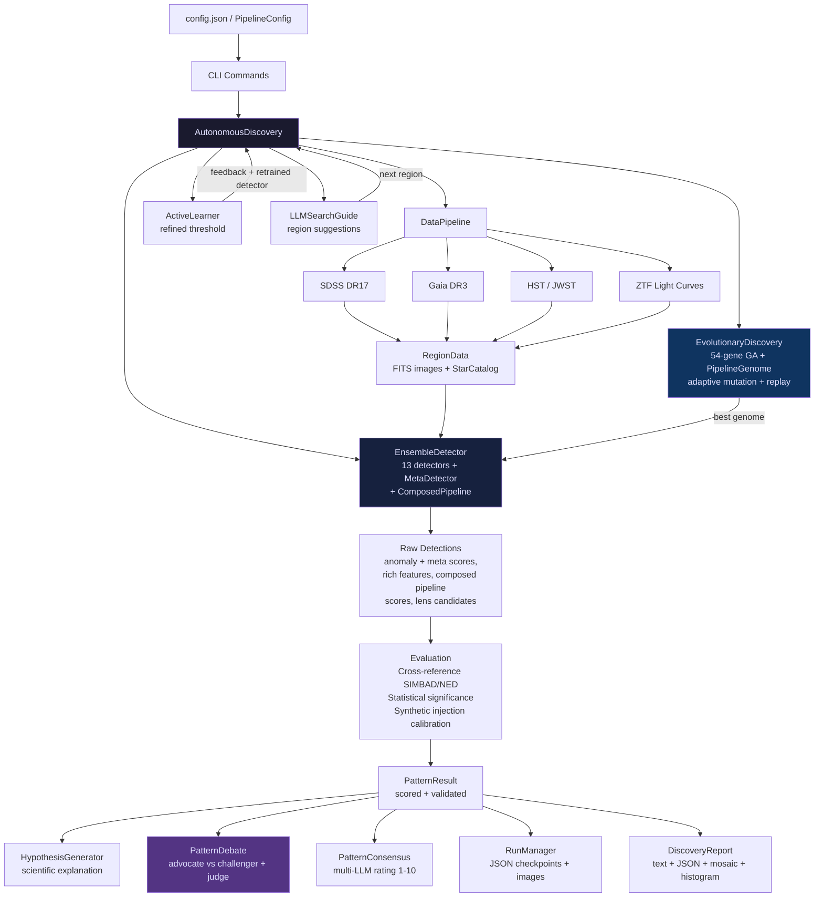

### 1.2 Autonomous Discovery Cycle

Each cycle of `AutonomousDiscovery.run()` follows this sequence:

```mermaid
flowchart LR
    START((Cycle N)) --> REGION[Select Region\nstrategy-guided\nsurvey grid\nor random]
    REGION --> FETCH[Fetch Data\nDataPipeline]
    FETCH --> DETECT[Run Detection\nEnsembleDetector]
    DETECT --> META[MetaDetector\nFeatureFusion\nComposedPipeline]
    META --> THRESHOLD{meta_score\n>= threshold?}
    THRESHOLD -- No --> LOG[Log + Continue]
    THRESHOLD -- Yes --> LOCAL[Local Classify\n+ Evaluate\n0 tokens]
    LOCAL --> SAVE_IMG[Save Overlay\nImages]
    SAVE_IMG --> XREF[Cross-Reference\nSIMBAD / NED]
    XREF --> ACTIVE[Active Learning\nLocal feedback]
    ACTIVE --> FLAG{Needs LLM\nreview?}
    FLAG -- Yes --> QUEUE[Queue for\nbatch review]
    FLAG -- No --> RECORD
    QUEUE --> RECORD[Record Finding\n+ Checkpoint]
    RECORD --> STRATEGY{cycle %\nstrategy_interval\n== 0?}
    STRATEGY -- Yes --> STRAT_RUN[Strategy Session\n~1,000 tokens\n+ batch review]
    STRAT_RUN --> EVOLVE
    STRATEGY -- No --> EVOLVE{cycle %\nevolve_interval\n== 0?}
    EVOLVE -- Yes --> EVO_RUN[Evolve Parameters\nGA + LLM-seeded]
    EVO_RUN --> NEXT
    EVOLVE -- No --> NEXT((Cycle N+1))
    LOG --> NEXT
```

---

## 2. Package Structure

```
src/star_pattern/
    __init__.py              Package root, version = "0.1.0"
    __main__.py              Entry point: python -m star_pattern
    cli.py                   Click CLI (7 subcommands)
    core/                    Foundation types and configuration
    data/                    Multi-survey data acquisition with caching
    detection/               13 pattern detectors + ensemble + feature fusion + meta-detector + compositional
    discovery/               Evolutionary optimization (GA + pipeline co-evolution)
    llm/                     Multi-provider LLM hypothesis, debate, consensus
    ml/                      Neural network backbones, models, training, representation manager
    evaluation/              Statistical testing, cross-reference, calibration
    visualization/           Plots, overlays, reports
    pipeline/                Orchestration (autonomous loop, batch, active learning)
    utils/                   GPU detection, logging, retry, run management
```

---

## 3. Core Layer (`core/`)

The core layer defines the data types threaded through every other layer. Nothing in `core/` imports from other `star_pattern` subpackages.

### 3.1 Configuration Hierarchy

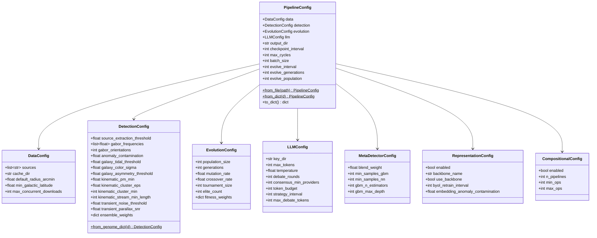

All configuration is expressed as Python dataclasses. `PipelineConfig.from_file()` loads a JSON file; `PipelineConfig.to_dict()` serializes for checkpointing. `DetectionConfig.from_genome_dict()` bridges the evolutionary system to the detection system by mapping the nested dict produced by `DetectionGenome.to_detection_config()` into a flat `DetectionConfig`.

### 3.2 Core Data Types

| Class | File | Purpose |
|---|---|---|
| `FITSImage` | `fits_handler.py` | FITS I/O via astropy. Holds `data` (ndarray), `header`, `wcs`. Methods: `from_file()`, `from_array()`, `normalize()` (arcsinh/log/linear/zscale), `to_tensor()` (PyTorch CHW), `cutout()`, `pixel_scale()`, `center_coord`, `save()`. |
| `SkyRegion` | `sky_region.py` | Equatorial coordinates (ra, dec in degrees, radius in arcmin). Properties: `center` (SkyCoord), `galactic_lat/lon`. Methods: `is_high_latitude()`, `separation_to()`, `random()` (avoids galactic plane). |
| `RegionData` | `sky_region.py` | Container binding a `SkyRegion` to its fetched data: `images: dict[str, FITSImage]` (band-keyed), `catalogs: dict[str, StarCatalog]` (source-keyed), `metadata: dict`. |
| `CatalogEntry` | `catalog.py` | Single source: ra, dec, magnitude, proper motion (pmra, pmdec), parallax, color index, object type, source ID. Methods: to_dict(), from_dict() for JSON serialization. |
| `StarCatalog` | `catalog.py` | List of `CatalogEntry` with source tracking. Supports len, iteration, and `to_table()` for astropy Table conversion. |
| `Anomaly` | `evaluation/metrics.py` | Single detected anomaly within a sky region. Fields: anomaly_type (lens_arc, overdensity, tidal_feature, comoving_group, etc.), detector name, pixel_x/y, sky_ra/dec (WCS-converted), score (normalized 0-1 across detectors), properties dict (raw_score, area, orientation, peak_snr, n_scales, etc.). Serializable via `to_dict()`. |
| `PatternResult` | `evaluation/metrics.py` | Scored detection result: region coordinates, detection type, anomaly score, significance, novelty, full details dict, cross-matches, hypothesis, debate verdict, consensus score, metadata, **anomalies list** (per-detection `Anomaly` objects extracted by `_extract_anomalies()`). `combined_score` property: $0.4 \cdot \text{anomaly} + 0.3 \cdot \text{significance} + 0.2 \cdot \text{novelty} + 0.1 \cdot \text{catalog\_novelty}$. |

---

## 4. Data Acquisition Layer (`data/`)

### 4.1 Data Source Architecture

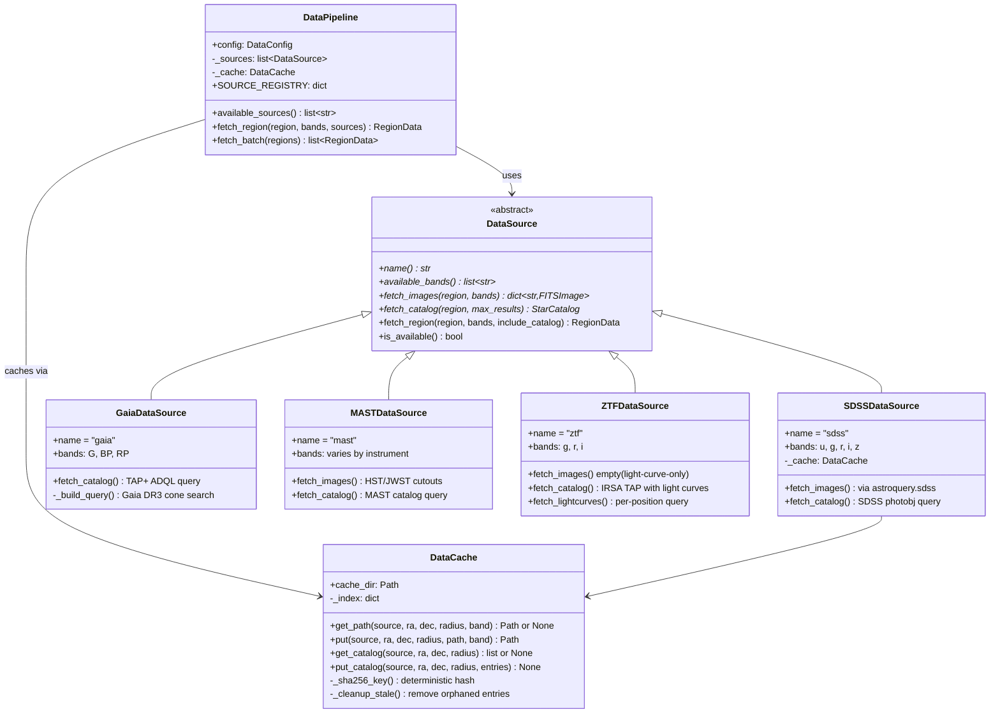

### 4.2 Data Flow

1. `DataPipeline.fetch_region()` iterates over configured sources.
2. Each `DataSource` fetches images (FITS) and/or catalogs for the given `SkyRegion`.
3. Downloaded FITS files are cached by `DataCache` using SHA256 keys computed from `(source, ra, dec, radius, band)`.
4. When multiple sources return the same band name, `DataPipeline` prefixes to avoid collisions (e.g., `sdss_r`, `gaia_G`).
5. Catalogs from different sources are merged into a single `StarCatalog` in the `RegionData`.

### 4.3 Cache Design

The cache uses a JSON index file (`cache_index.json`) mapping SHA256 keys to file paths. On `get()`, stale entries (files deleted from disk) are cleaned up. Cache keys are deterministic: the same query always hits the same cache entry. Both FITS images and catalog query results are cached. Catalog entries use a special `__catalog__` band key to distinguish them from image cache entries, and are stored as JSON files containing lists of serialized CatalogEntry dicts.

### 4.4 Wide-Field Sky Coverage

For fields larger than a single tile (~3 arcmin), the `WideFieldPipeline` orchestrates tiling, multi-source fetch, and mosaicking:

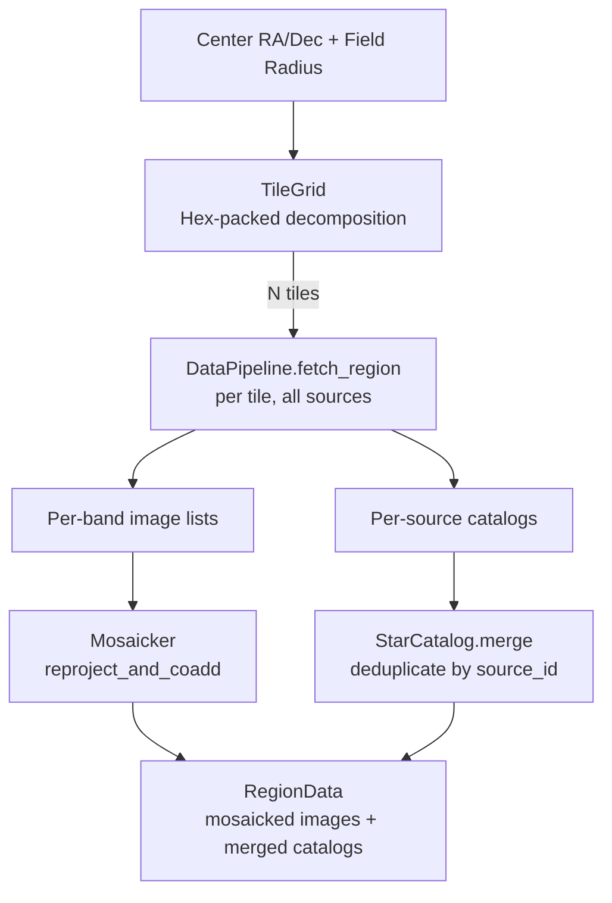

| Class | File | Purpose |
|---|---|---|
| `WideFieldConfig` | `core/config.py` | Tile radius, overlap, max tiles, pixel scale, combine method |
| `TileGrid` | `core/tiling.py` | Hex-packed sky tiling with cos(dec) RA correction, Vincenty separation |
| `Mosaicker` | `data/mosaic.py` | Wraps `reproject` to find optimal WCS, reproject, and co-add tiles |
| `WideFieldPipeline` | `data/wide_field.py` | Orchestrator: TileGrid + DataPipeline + Mosaicker |

The `EnsembleDetector` is pixel-scale-aware: it reads `FITSImage.pixel_scale()` and passes `pixel_scale_arcsec` to `LensDetector`, `ClassicalDetector`, and `GalaxyDetector` so arc/ring radii and filter kernels scale to physical sizes at any resolution.

---

## 5. Detection Layer (`detection/`)

### 5.1 Detector Ensemble

The `EnsembleDetector` orchestrates thirteen specialized detectors, each producing an independent score in [0, 1]. Scores are combined via configurable weights.

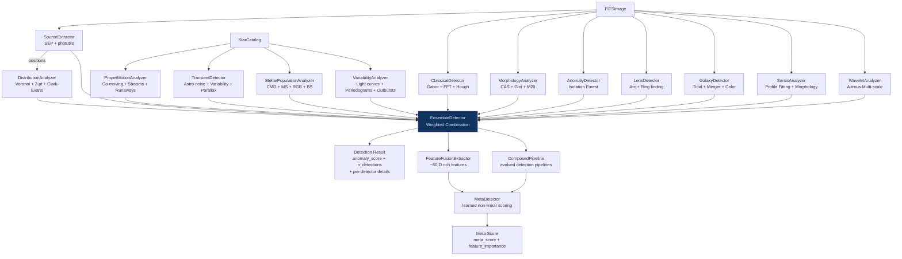

### 5.2 Detector Details

#### SourceExtractor (`source_extraction.py`)

Uses the SEP library (C-accelerated) with photutils as fallback. Extracts point sources from the image, producing:
- Source positions (x, y pixel coordinates)
- Star/galaxy classification mask
- Source density grid
- Flux measurements

Configurable via `source_extraction_threshold` (detection sigma) and deblending parameters from the genome.

#### ClassicalDetector (`classical.py`)

Composes three sub-detectors:

| Sub-Detector | Algorithm | Output |
|---|---|---|
| `GaborFilterBank` | Multi-frequency, multi-orientation Gabor filters applied via FFT convolution | Max response map, mean energy, dominant orientation per pixel |
| `FFTAnalyzer` | 2D FFT power spectrum with azimuthally-averaged radial profile | Dominant spatial frequency, total power |
| `HoughArcDetector` | Circle Hough transform on Canny edges | Top 20 arc candidates with center, radius, votes |

The `classical_score` is the average of `gabor_score` (mean of max response) and `arc_score` (strongest arc's normalized votes).

#### MorphologyAnalyzer (`morphology.py`)

Computes non-parametric morphological statistics:

| Metric | What It Measures |
|---|---|
| Concentration (C) | Light fraction in inner vs outer radii |
| Asymmetry (A) | Residual under 180-degree rotation |
| Smoothness (S) | Residual after Gaussian smoothing |
| Gini coefficient | Inequality of pixel flux distribution |
| M20 | Second-order moment of brightest 20% pixels |
| Ellipticity | Shape from image moments |

The `morphology_score` is a weighted combination tuned to flag disturbed or irregular objects.

#### AnomalyDetector (`anomaly.py`)

Trains a scikit-learn `IsolationForest` on feature vectors extracted from the image. The contamination parameter (fraction of expected outliers) is genome-tunable. Also supports `EmbeddingAnomalyDetector` that operates on deep backbone embeddings.

#### LensDetector (`lens_detector.py`)

Searches for gravitational lensing signatures:

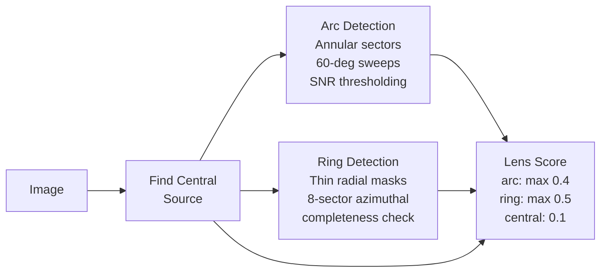

Arc detection divides annular regions into 60-degree sectors and measures the SNR of residuals after subtracting a smooth background. Ring detection checks azimuthal completeness across 8 sectors at each radius.

#### DistributionAnalyzer (`distribution.py`)

Analyzes spatial clustering of source positions:

| Method | Statistic | Interpretation |
|---|---|---|
| Voronoi tessellation | Cell area coefficient of variation (CV) | $\text{CV} \gg 0.53$ (Poisson) indicates clustering |
| Two-point correlation | Binned pair distance histogram vs Poisson | Excess at small scales = clustering |
| Clark-Evans | Mean nearest-neighbor distance / expected | $R < 1$: clustered, $R = 1$: random, $R > 1$: uniform |
| KDE overdensity | Gaussian kernel density on grid | Peaks above $3\sigma$ flagged as overdensities |

Requires >= 10 source positions to run (otherwise skipped by the ensemble).

#### GalaxyDetector (`galaxy_detector.py`)

Detects three categories of galaxy features:

1. **Tidal features**: Subtracts a smooth model (large Gaussian), applies Gabor filters to residuals, thresholds to find extended low-surface-brightness streams.
2. **Merger candidates**: Finds double nuclei via peak detection, measures asymmetry between pairs, flags high-asymmetry close pairs.
3. **Color anomalies**: For multi-band data, identifies sources with colors deviating $> N\sigma$ from the field median.

#### ProperMotionAnalyzer (`proper_motion.py`)

Operates on `StarCatalog` entries with proper motion data (typically from Gaia):

1. **Co-moving groups**: DBSCAN clustering in (pmra, pmdec) space. Groups with >= `cluster_min` members flagged.
2. **Stellar streams**: RANSAC fitting in 4D (ra, dec, pmra, pmdec) to find linear structures.
3. **Runaway stars**: Sigma-clipping on total proper motion magnitude to flag high-velocity outliers.

#### TransientDetector (`transient.py`)

Operates on catalog entries with astrometric solution quality metrics:

1. **Astrometric excess noise**: Flags sources with noise >> field median (bad fits or unresolved binaries).
2. **Photometric variability**: Identifies color outliers suggesting variability.
3. **Parallax anomalies**: Flags sources with parallax SNR significantly different from expectations.

#### SersicAnalyzer (`sersic.py`)

Fits parametric Sersic profiles to galaxy images:

| Step | Method | Output |
|---|---|---|
| Center finding | Brightest pixel near image center | (cx, cy) |
| Ellipticity | Image moments ($I_{xx}$, $I_{yy}$, $I_{xy}$) | ellipticity, position angle |
| Radial profile | Elliptical annuli averaging | Intensity vs radius |
| Profile fit | scipy.optimize.curve_fit on $I(r) = I_e \exp\!\left(-b_n \left[\left(\frac{r}{r_e}\right)^{1/n} - 1\right]\right)$ | n, r_e, I_e |
| 2D model | Reconstruct model from fit parameters | Model image |
| Residuals | $\text{data} - \text{model}$, threshold at $\text{residual\_sigma} \cdot \text{rms}$ | Substructure features |
| Classification | n + ellipticity thresholds | disk/spiral, elliptical, lenticular, edge-on, compact/cD, irregular |

The `sersic_score` rewards successful fits with physically reasonable parameters ($0.3 < n < 8$, $r_e > 1$ pixel) and penalizes poor fits or featureless residuals.

#### WaveletAnalyzer (`wavelet.py`)

Implements the a-trous (stationary) wavelet transform using the B3 spline kernel, the standard tool in astronomical image analysis (Starck & Murtagh 2002, SExtractor):

| Step | Method | Output |
|---|---|---|
| Decomposition | A-trous with B3 kernel $[1,4,6,4,1]/16$ at increasing scales | Detail planes + smooth residual |
| Noise estimation | $\sigma_j = 1.4826 \cdot \text{median}(\|W_j\|)$ (robust to source contamination) | Per-scale noise sigma |
| Significance map | $S_j = \|W_j\| / \sigma_j > \text{threshold}$ | Per-scale detection mask |
| Source detection | Connected components in significance maps | Position, peak SNR, scale |
| Multi-scale objects | Cross-match detections at adjacent scales (within $2^\text{scale}$ pixels) | Objects spanning multiple scales |
| Scale spectrum | $E_j = \sum W_j^2 / \sum_k W_k^2$, normalized to sum=1 | Scale distribution |

The `wavelet_score` combines detection richness, multi-scale object count, and scale spectrum breadth. The decomposition has perfect reconstruction: $\text{original} = W_1 + W_2 + \cdots + W_J + c_J$.

#### StellarPopulationAnalyzer (`stellar_population.py`)

Analyzes stellar populations through color-magnitude diagrams (CMDs):

| Feature | Detection Method | What It Finds |
|---|---|---|
| Main sequence | Running median fit in magnitude bins, membership within ms_width | MS stars, turnoff point |
| Red giant branch | Brighter than turnoff + redder than turnoff + offset | RGB stars, RGB tip |
| Blue stragglers | Brighter than turnoff + bluer than turnoff - offset | BS candidates (binary mergers/mass transfer) |
| Multiple populations | Color bimodality test ($\text{gap}/\text{median} > 3$) per magnitude bin | Parallel sequences (age/metallicity spread) |
| Color distribution | Median, spread, skewness, kurtosis, $3\sigma$ outliers | Population anomalies |
| CMD density | 2D histogram + Gaussian smoothing + local maximum detection | Sequence peaks |

Uses Gaia BP-RP color by default, falls back to SDSS g-r. The turnoff is estimated from the density peak (first bright magnitude bin with >= 30% of peak bin count) rather than the single brightest star, preventing blue stragglers from defining the turnoff.

#### VariabilityAnalyzer (`variability.py`)

Analyzes multi-epoch light curves (primarily from ZTF) for time-domain variability:

| Step | Method | Output |
|---|---|---|
| Variability indices | Weighted stdev, reduced chi-squared, IQR, von Neumann eta, amplitude, MAD | Per-source variability metrics |
| Periodogram | `astropy.timeseries.LombScargle` on unevenly sampled data | Best period, power, false alarm probability |
| Outburst detection | Median baseline + MAD-based sigma thresholding | Brightening/fading events above $N\sigma$ |
| Classification | Rule-based from period/amplitude/shape | periodic_pulsator, eclipsing_binary, eruptive, long_period_variable, agn_like, transient |

The `variability_score` combines the fraction of variable sources, chi-squared significance, periodogram power, and outburst count. Light curves are stored in `CatalogEntry.properties["ztf_lightcurve"]` as `{band: [(mjd, mag, magerr), ...]}`.

### 5.3 Ensemble Scoring

`EnsembleDetector.detect()` combines the eleven score categories:

$$\begin{aligned}
\text{anomaly\_score} &= w_\text{classical} \cdot \text{classical\_score} \\
&+ w_\text{morphology} \cdot \text{morphology\_score} \\
&+ w_\text{anomaly} \cdot \text{anomaly\_score} \\
&+ w_\text{distribution} \cdot \text{distribution\_score} \\
&+ w_\text{galaxy} \cdot \text{galaxy\_score} \\
&+ w_\text{kinematic} \cdot \text{kinematic\_score} \\
&+ w_\text{transient} \cdot \text{transient\_score} \\
&+ w_\text{sersic} \cdot \text{sersic\_score} \\
&+ w_\text{wavelet} \cdot \text{wavelet\_score} \\
&+ w_\text{population} \cdot \text{population\_score} \\
&+ w_\text{variability} \cdot \text{variability\_score}
\end{aligned}$$

Default weights: classical=0.09, morphology=0.09, anomaly=0.09, lens=0.09, distribution=0.11, galaxy=0.09, kinematic=0.09, transient=0.04, sersic=0.07, wavelet=0.09, population=0.06, variability=0.09. All weights are genome-tunable and normalized to sum to 1.

### 5.4 Cross-Detector Feature Fusion

After computing per-detector scores, the `FeatureFusionExtractor` extracts a ~60-dimensional feature vector from the full detection results dict. Features are grouped by detector:

- Sources (5): n_sources, mean_flux, flux_std, spatial_concentration, ellipticity_mean
- Classical (6): gabor_score, fft_score, arc_score, n_arcs, dominant_frequency, dominant_orientation
- Morphology (6): concentration, asymmetry, smoothness, gini, m20, morphology_score
- Lens (5): lens_score, n_arcs, n_rings, arc_coverage, is_candidate
- Distribution (4): distribution_score, voronoi_cv, clark_evans_r, n_overdensities
- Galaxy (4): galaxy_score, n_tidal, n_mergers, n_color_outliers
- Kinematic (4): kinematic_score, n_groups, n_streams, n_runaways
- Transient (4): transient_score, n_astrometric, n_photometric, n_parallax
- Sersic (5): sersic_score, sersic_n, r_e, ellipticity, n_residual_features
- Wavelet (4): wavelet_score, n_detections, n_multiscale, mean_scale
- Population (4): population_score, n_blue_stragglers, n_red_giants, multiple_populations
- Variability (4): variability_score, n_variables, n_periodic, n_transients

Missing or errored fields default to 0. The feature vector is stored in `results["rich_features"]`.

### 5.5 Learned Meta-Detector

The `MetaDetector` learns non-linear cross-detector scoring via active learning feedback:

| Label Count | Model | Behavior |
|---|---|---|
| 0-49 | Linear baseline | Identical to weighted ensemble |
| 50-199 | Gradient boosting | `sklearn.ensemble.GradientBoostingClassifier` |
| 200+ | Neural network | PyTorch MLP [n_features, 64, 32, 1] |

The meta-score blends linear and learned scores: $\text{meta\_score} = (1 - w_\text{blend}) \cdot s_\text{linear} + w_\text{blend} \cdot s_\text{learned}$. The `blend_weight` is genome-evolvable. Feature importance is tracked for interpretability.

### 5.6 Compositional Detection (Evolved Pipelines)

The `ComposedPipeline` system enables discovery of detection strategies not hard-coded in the 13 detectors. A pipeline is a sequence of 2-5 primitive operations:

| Operation | Purpose |
|---|---|
| `mask_sources` | Zero out detected source positions |
| `subtract_model` | Subtract Sersic/smooth model |
| `wavelet_residual` | Extract residual at specific scale |
| `threshold_image` | Binary threshold at percentile |
| `convolve_kernel` | Convolve with parameterized kernel |
| `cross_correlate` | Correlate with source density map |
| `combine_masks` | AND/OR/XOR of current + context mask |
| `region_statistics` | Stats on masked regions |
| `edge_detect` | Sobel/Canny edge detection |
| `radial_profile_residual` | Subtract radial profile |

`PipelineGenome` encodes these as variable-length genomes with structural mutation (add/remove/swap ops) and parametric mutation (modify op params). A population of pipeline genomes is co-evolved alongside the `DetectionGenome` during `_evolve_parameters()`. Eight preset pipelines seed the initial population.

---

## 6. Evolutionary Discovery (`discovery/`)

### 6.1 Genome Structure

The `DetectionGenome` encodes 54 detection parameters as a float vector. Each gene has a defined range, type, and biological analogy:

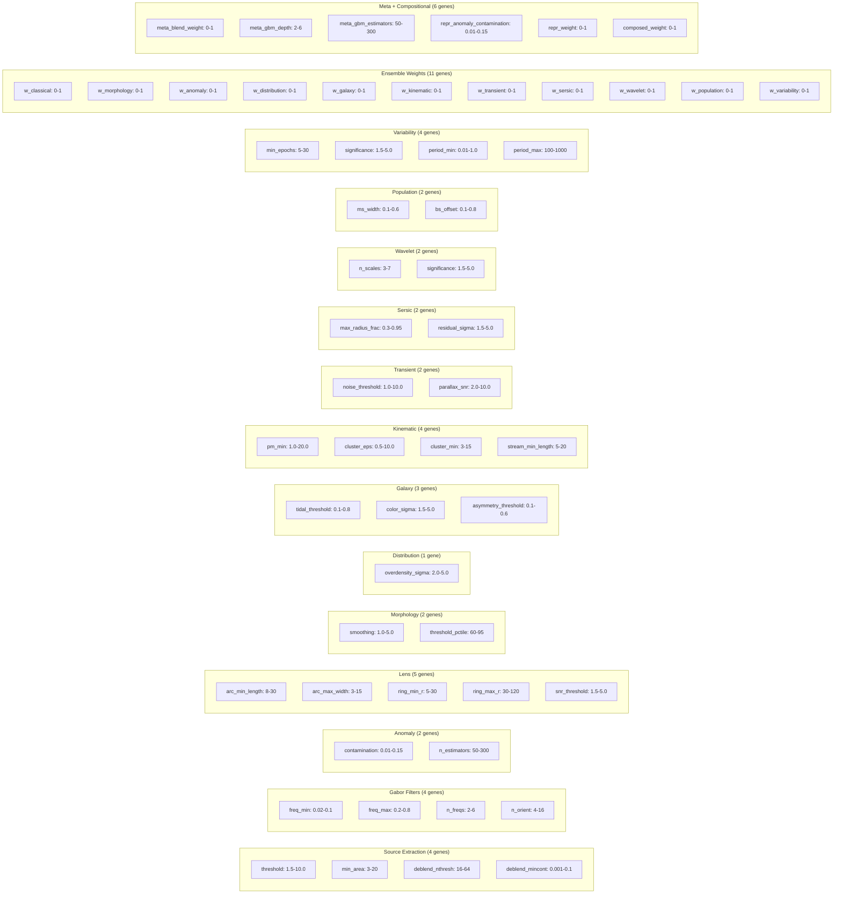

The 11 ensemble weight genes are normalized to sum to 1 in `to_detection_config()`.

### 6.2 Genetic Algorithm

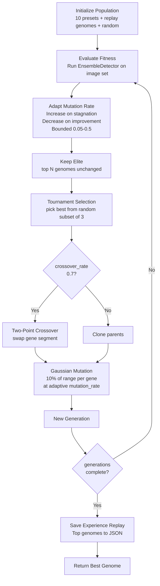

**Preset genomes** seed the initial population with domain knowledge: lens-focused, morphology-focused, distribution-focused, balanced, sensitive (low thresholds), kinematic-focused, transient-focused, sersic-focused, wavelet-focused, CMD/population-focused, and variability-focused. **Experience replay** loads the best genomes from previous runs (persisted to `experience_replay.json`) to warm-start the population.

**Pipeline co-evolution**: Alongside the standard `DetectionGenome` GA, a separate population of `PipelineGenome` instances (variable-length sequences of 2-5 operations) co-evolves. Pipeline genomes undergo structural mutation (add/remove/swap operations) and parametric mutation (modify operation parameters). Eight preset pipelines seed the initial population.

### 6.3 Fitness Function

The `FitnessEvaluator` computes a 5-component fitness score:

$$\text{Fitness} = 0.35 \cdot \text{anomaly} + 0.25 \cdot \text{significance} + 0.15 \cdot \text{novelty} + 0.1 \cdot \text{diversity} + 0.15 \cdot \text{recovery}$$

| Component | Calculation | Purpose |
|---|---|---|
| **Anomaly** (0.35) | Mean of top-20% anomaly scores across images | Reward finding high-scoring detections |
| **Significance** (0.25) | $\text{mean}(s) / \text{std}(s)$, capped at 1.0 | Reward consistent signal above noise |
| **Novelty** (0.15) | Euclidean distance from last 20 genomes' mean feature vectors | Reward exploring new parameter space |
| **Diversity** (0.1) | Mean pairwise distance of feature vectors across images | Reward finding varied pattern types |
| **Recovery** (0.15) | Fraction of injected synthetic patterns detected | Ground-truth detection ability |

The recovery component uses `SyntheticInjector` to inject known patterns (arcs, rings, overdensities) into images and measures the detection rate, providing a ground-truth fitness signal.

The feature vector for novelty/diversity uses the ~60-dimensional rich feature vector from `FeatureFusionExtractor` when available, falling back to a 13-dimensional vector: anomaly score, detection count, gabor score, morphology score, lens score, distribution score, galaxy score, kinematic score, transient score, sersic score, wavelet score, population score, variability score.

### 6.4 Adaptive Evolution in Autonomous Mode

During autonomous discovery, evolution runs inline every `evolve_interval` cycles (default 25):

1. The pipeline buffers the last 50 processed `FITSImage` objects.
2. A short evolutionary run (5 generations, population 15) optimizes parameters on the buffered images.
3. The best genome's parameters replace the current `DetectionConfig`.
4. The `EnsembleDetector` is reconstructed with the new config.
5. Evolution history (cycle, fitness, components) is recorded and included in reports.

---

## 7. LLM Integration Layer (`llm/`)

### 7.1 LLM-as-Strategist Architecture

The LLM integration follows a **strategist pattern**: LLMs are called rarely but with high impact, while all heavy computation runs locally at zero token cost.

```mermaid
flowchart TD
    subgraph LOCAL["Detection Cycle (LOCAL - zero tokens)"]
        direction LR
        FETCH[Fetch Data] --> DETECT[12 Detectors]
        DETECT --> LC[LocalClassifier\nrule-based]
        LC --> LE[LocalEvaluator\nSNR + agreement]
        LE --> AL[ActiveLearner\nfeedback]
        LE --> |flagged| QUEUE[Queue for\nbatch review]
    end

    subgraph STRATEGY["Strategy Session (LLM - ~1,000 tokens, every 25 cycles)"]
        direction LR
        SUMMARY[Batch Summary] --> SA[StrategyAdvisor]
        SA --> SR[StrategyResult\nadjustments + weights\n+ regions + guidance]
        QUEUE --> |3-5 items| BATCH[Batch Review\n~1,500 tokens]
    end

    subgraph EVOLUTION["Evolution Cycle (LOCAL + LLM-seeded)"]
        direction LR
        POP[Population\npresets + replay\n+ LLM variants] --> FIT[Fitness\nevaluation]
        FIT --> SELECT[Tournament\nselection]
        SELECT --> BEST[Best genome\nupdate detectors]
    end

    SR --> |weights| AL
    SR --> |regions| FETCH
    SR --> |parameters| POP
    LOCAL --> STRATEGY
    STRATEGY --> EVOLUTION
```

#### Token Consumption Comparison

| Workflow | Before (tokens/cycle) | After (tokens/cycle) |
|---|---|---|
| Hypothesis generation | 2,500 per detection | 0 (LocalClassifier) |
| Debate (7 LLM calls) | 15,000 per high-scoring | 0 (LocalEvaluator) |
| Active learning feedback | 110 per uncertain | 0 (local labels) |
| Search guidance | 500 (amortized) | 0 (part of strategy session) |
| Strategy session | N/A | 100 (amortized: 2,500 / 25 cycles) |
| Batch review | N/A | 60-100 (amortized: flagged items only) |
| **Total** | **~20,700** | **~160-200** |
| **Reduction** | | **~99%** |

#### Key Components

| Class | File | Purpose |
|---|---|---|
| `TokenTracker` | `llm/token_tracker.py` | Track all LLM calls, enforce per-session budget |
| `LLMCache` | `llm/cache.py` | SHA256-keyed response caching with TTL |
| `LocalClassifier` | `detection/local_classifier.py` | Rule-based classification from detector scores |
| `LocalEvaluator` | `detection/local_evaluator.py` | SNR/agreement-based verdict (real/artifact/inconclusive) |
| `StrategyAdvisor` | `llm/strategy.py` | Periodic LLM batch review + strategic guidance |
| `StrategyResult` | `llm/strategy.py` | Actionable output: parameter/weight/region adjustments |

#### Closed-Loop Learning

The strategy system creates a feedback loop:
1. **LLM advises**: StrategyAdvisor reviews batch summary, suggests adjustments
2. **Pipeline executes**: LocalClassifier/LocalEvaluator process detections locally
3. **Outcomes measured**: ActiveLearner tracks interesting rate and detector accuracy
4. **Outcomes fed back**: Next strategy session includes previous strategy outcome
5. **LLM refines**: Strategy adjusted based on what worked and what did not

### 7.2 Provider System

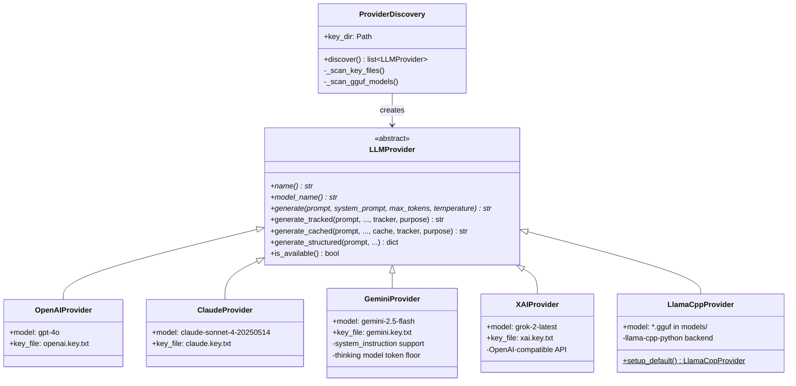

`ProviderDiscovery` auto-scans the project root for `*.key.txt` files and instantiates the matching provider. Local GGUF models in `models/` are also discovered. The system degrades gracefully: if no keys are found, LLM features are disabled.

### 7.2 Hypothesis Generation

`HypothesisGenerator` takes a `PatternResult` and produces:
- A scientific hypothesis explaining the detected pattern
- A confidence score (0-1)
- A list of testable predictions

Uses the `SYSTEM_ASTRONOMER` system prompt for domain expertise.

### 7.3 Adversarial Debate

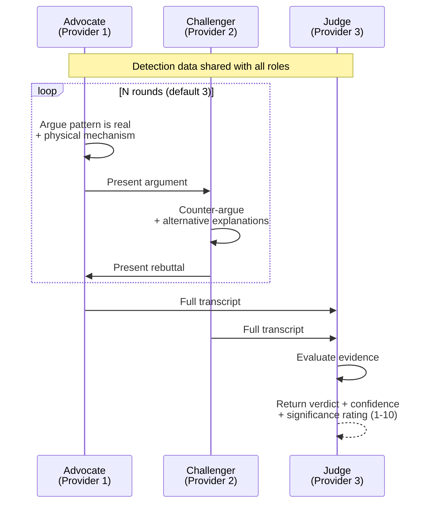

Different LLM providers are assigned to different roles to avoid self-reinforcing biases. If a provider fails, the system falls back through the provider list.

### 7.4 Consensus Scoring

`PatternConsensus` queries all available providers independently:

1. Each provider rates the pattern (1-10 scale) and categorizes it.
2. Individual ratings with rationales are collected.
3. Aggregation:
   - **Consensus rating**: mean of all ratings
   - **Agreement**: $1 - (\sigma / 5)$ in $[0, 1]$
   - **Consensus category**: Borda count across providers' category votes

### 7.5 Search Guidance

`LLMSearchGuide` provides strategic region selection:

1. Summarizes recent top findings and searched regions.
2. Asks the LLM (temperature 0.8 for creativity) to suggest new regions with rationales.
3. Validates suggested coordinates (RA 0-360, Dec -90 to +90).
4. Used every 5 cycles in the autonomous loop; falls back to random regions on failure.

---

## 8. Machine Learning Layer (`ml/`)

### 8.1 Architecture

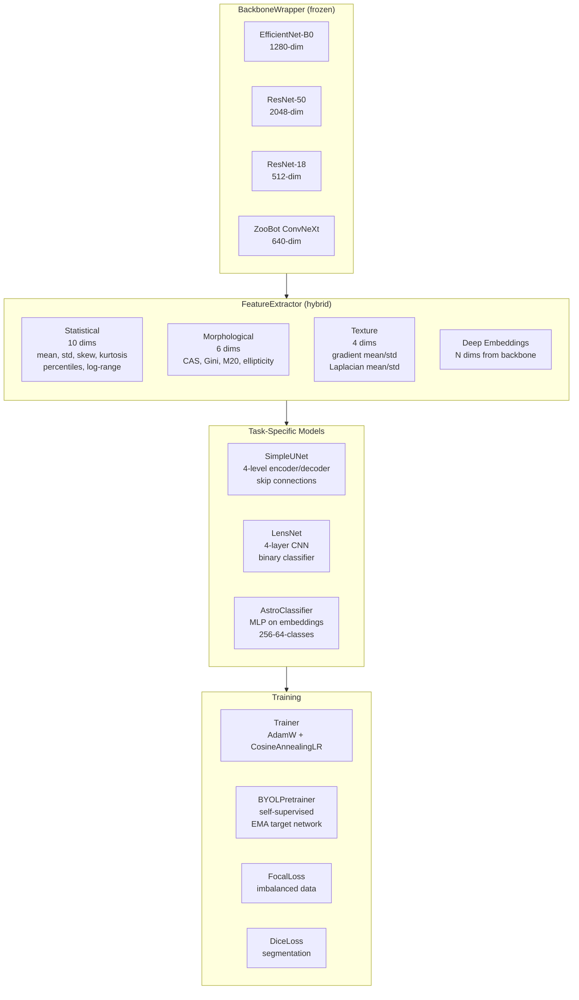

### 8.1.1 Representation Manager

The `RepresentationManager` orchestrates existing ML infrastructure into the autonomous pipeline:

| Existing Component | Role in Pipeline |
|---|---|
| `BackboneWrapper` | Image embedding (1280-D EfficientNet or 20-D stat features on CPU) |
| `FeatureExtractor` | Hybrid stat + morphological + texture + deep features |
| `SSLPretrainer` | BYOL self-supervised retraining during evolution phases |
| `EmbeddingAnomalyDetector` | Embedding-space anomaly scoring (Isolation Forest) |

The manager buffers images during detection, periodically retrains the backbone via BYOL during evolution phases (not during detection hot path), and provides `embedding_anomaly_score` as an additional feature for the meta-detector.

### 8.2 Feature Pipeline

`FeatureExtractor.extract(image)` produces a concatenated feature vector:

| Group | Dimensions | Features |
|---|---|---|
| Statistical | 10 | mean, std, skewness, kurtosis, 5th/25th/50th/75th/95th percentiles, log(max-min) |
| Morphological | 6 | Concentration, Asymmetry, Smoothness, Gini, M20, ellipticity |
| Texture | 4 | Gradient magnitude mean/std, Laplacian mean/std |
| Deep (optional) | 512-2048 | Backbone embeddings (EfficientNet/ResNet/ZooBot) |

### 8.3 Models

| Model | Architecture | Task |
|---|---|---|
| `SimpleUNet` | 4-level encoder-decoder with skip connections (32-64-128-256 features, bottleneck 512) | Segmentation (e.g., arc masks) |
| `LensNet` | 4-layer CNN (32-64-128-256) + AdaptiveAvgPool + MLP (4096-256-1) | Binary lens/not-lens classification |
| `AstroClassifier` | MLP head (embedding_dim-256-64-classes) with dropout | Multi-class pattern classification |
| `BYOLPretrainer` | Dual-network (online + EMA target) with projection/prediction heads | Self-supervised pretraining on unlabeled FITS |

---

## 9. Evaluation Layer (`evaluation/`)

### 9.1 Statistical Validation

| Function | Test | Returns |
|---|---|---|
| `bootstrap_confidence()` | Non-parametric CI via resampling | estimate, lower, upper, std |
| `ks_test_uniformity()` | Kolmogorov-Smirnov for [0,1] uniformity | statistic, p_value |
| `anderson_darling_normality()` | Anderson-Darling for Gaussian | statistic, critical_values, significance_levels |
| `multiple_comparison_correction()` | Bonferroni or Benjamini-Hochberg FDR | corrected p-values |
| `permutation_test()` | Permutation distribution of test statistic | p_value, observed, null distribution |

### 9.2 Per-Anomaly Extraction

`_extract_anomalies()` in `autonomous.py` iterates each detector's output and creates an `Anomaly` object for each spatially-located detection:

| Source | Anomaly Types | Coordinate Source |
|---|---|---|
| Lens arcs/rings | `lens_arc`, `lens_ring` | Pixel (WCS-converted to sky) |
| Distribution overdensities | `overdensity` | Pixel |
| Wavelet multiscale objects | `multiscale_object` | Pixel |
| Galaxy tidal features | `tidal_feature` | Pixel |
| Galaxy merger nuclei | `merger` | Pixel |
| Classical Hough arcs | `classical_arc` | Pixel |
| Sersic residual features | `sersic_residual` | Pixel |
| Kinematic groups/streams/runaways | `comoving_group`, `stellar_stream`, `runaway_star` | Catalog RA/Dec |
| Transient flux outliers | `flux_outlier` | Catalog RA/Dec |
| Variability candidates | `variable_star`, `periodic_variable` | Catalog RA/Dec |
| Stellar population | `blue_straggler`, `red_giant` | Region-level (no coords) |

Scoring: Raw detector scores use incompatible scales (galaxy strength ~100k, overdensity sigma ~1-10, wavelet n_scales ~1-5). Scores are normalized to [0, 1] per detector before global ranking. Each detector is capped at 8 anomalies (`_MAX_PER_DETECTOR`), total capped at 50 per region (`_MAX_ANOMALIES_PER_REGION`). Raw scores preserved in `properties["raw_score"]` for display.

### 9.3 Cross-Reference


`CatalogCrossReferencer.cross_reference(ra, dec)` queries SIMBAD, NED, and the Transient Name Server (TNS) for known objects within the search radius. Returns object names, types, and angular separations. Used to distinguish novel detections from known objects. TNS matches identify known transients (supernovae, novae, etc.).

### 9.4 Synthetic Injection

`SyntheticInjector` provides calibration by injecting known anomalies into real images:

| Method | What It Injects |
|---|---|
| `inject_arc()` | Gaussian-profile arc at specified radius/angle |
| `inject_ring()` | Einstein ring with configurable completeness |
| `inject_overdensity()` | Cluster of point sources via PSF convolution |
| `inject_random()` | Random anomaly type selection |

Each returns `(modified_image, injection_metadata)` for detection rate measurement.

---

## 10. Visualization Layer (`visualization/`)

### 10.1 Overlay Functions

`pattern_overlay.py` provides annotation functions that take a `FITSImage` and detection results, returning a matplotlib `Figure`:

| Function | Annotations |
|---|---|
| `overlay_sources()` | Star (cyan) and galaxy (lime) markers from source extraction |
| `overlay_lens_detection()` | Central source cross, arc circles (yellow dashed), ring circles (lime/orange) |
| `overlay_distribution()` | Source positions (cyan), overdensity circles (red) with sigma labels |
| `overlay_kinematic_groups()` | Proper motion quiver plot, co-moving group circles, runaway star crosses |
| `overlay_galaxy_features()` | Tidal feature circles (magenta), merger candidate pairs (red lines + asymmetry labels) |

### 10.2 Discovery Mosaic

`mosaic.py` creates an anomaly-centric mosaic (`create_discovery_mosaic()`) with cutouts centered on the top-scoring individual anomalies:

- **Overview panel**: full-field image with numbered yellow markers at each anomaly position (WCS-converted)
- **Cutout panels**: one per anomaly, sorted by normalized score, showing:
  - ZScale-stretched grayscale image centered on the detection
  - Cyan crosshair at the detection centroid
  - Yellow dashed circle sized to the feature (point-source radius or sqrt(area/pi) for extended features)
  - Label: anomaly number, type, parent finding

**Cutout sizing**: Point sources use 3% of image dimension (clamped [30, 200] px). Extended features (tidal, sersic residual, multiscale) scale to 1.5x the feature's characteristic radius from its area property (clamped [60, 400] px).

**Signal quality filter**: Point-source anomalies are checked for actual signal at their pixel center (2-sigma above local median). Anomalies with no detectable source are skipped in favor of the next ranked anomaly. Extended feature types bypass this filter.

**Extended feature recentering**: Tidal features and sersic residuals often have centroids in faint sky between the bright source and background. The cutout searches within the feature's radius for the brightest pixel and recenters on it when significantly brighter (> 2 sigma), so the visualization shows the source generating the gradient with the feature visible around it.

Falls back to per-finding panels (legacy `_create_finding_mosaic()`) when no per-anomaly data is available.

### 10.3 Reports

`DiscoveryReport.generate_full_report()` produces:
- **Markdown report** (`report.md`): findings with per-anomaly tables (type, location, detector, score, properties), catalog cross-references, evidence metrics, anomaly summary by type
- **JSON report** (`report.json`): machine-readable full data including serialized anomaly list per finding
- **Mosaic** (`mosaic.png`): anomaly-centric cutout grid
- **Histogram** (`scores_histogram.png`): score distribution plot

**Per-anomaly table** in each finding:

| Column | Content |
|---|---|
| # | Anomaly ID (A1, A2, ...) |
| Type | Human-readable name (Lens arc, Tidal feat., Co-moving grp, etc.) |
| Location | RA, Dec (sky) or px (x, y) for pixel-only |
| Detector | Source detector name |
| Score | Raw value with units (SNR, sigma, scales) or normalized for arbitrary-scale detectors |
| Key properties | Compact summary (radius, area, orientation, n_members, period, etc.) |

---

## 11. Pipeline Orchestration (`pipeline/`)

### 11.1 AutonomousDiscovery

The main orchestrator. See Section 1.2 for the cycle diagram. Key integration points:

| Feature | Mechanism |
|---|---|
| Local classification | `LocalClassifier.classify()` replaces LLM hypothesis generation (0 tokens) |
| Local evaluation | `LocalEvaluator.evaluate()` replaces LLM debate (0 tokens) |
| Strategy sessions | `StrategyAdvisor.review_session()` every `strategy_interval` cycles (~1,000 tokens) |
| Batch review | Flagged findings reviewed in batch during strategy sessions (~1,500 tokens) |
| Token tracking | `TokenTracker` enforces session budget, saves usage to `token_usage.json` |
| Response caching | `LLMCache` prevents redundant LLM calls via SHA256-keyed cache |
| Image saving | `_save_finding_images()` calls overlay functions and saves via `RunManager.save_image()` |
| Adaptive evolution | `_evolve_parameters()` runs a short GA with LLM-seeded population variants |
| Active learning | `ActiveLearner` with local feedback, strategy-informed weight adjustments |
| Meta-detector scoring | `MetaDetector.score()` on rich features; `meta_score` used for thresholding |
| Representation learning | `RepresentationManager` embeds images, computes embedding anomaly scores |
| Composed pipelines | Best `ComposedPipeline` runs on each image; `composed_score` injected into results |
| Pipeline co-evolution | `PipelineGenome` population co-evolved during `_evolve_parameters()` |
| Report generation | `_generate_report()` includes token usage summary |
| Graceful shutdown | Fast SIGINT: first CTRL-C stops after current phase (not cycle), second CTRL-C exits immediately via SystemExit(1) |
| Strategy-guided search | `StrategyResult.focus_regions` suggests regions based on batch analysis |
| HEALPix survey | `HEALPixSurvey` provides systematic equal-area sky tiling with resumable state |

### 11.2 HEALPix Survey Mode

The `HEALPixSurvey` class provides systematic sky coverage using HEALPix equal-area pixelization:

| Class | File | Purpose |
|---|---|---|
| `SurveyConfig` | `core/config.py` | NSIDE, galactic latitude filter, visit order, state file |
| `HEALPixSurvey` | `core/healpix_survey.py` | Pixel list generation, visit ordering, state persistence |

Region selection priority in `_get_next_region()`:
1. LLM strategy-suggested regions
2. HEALPix survey grid (if enabled)
3. Random region

Visit ordering strategies:
- `galactic_latitude`: High |b| first (cleaner fields, less extinction) -- default
- `random_shuffle`: Randomized order (avoids systematic biases)
- `dec_sweep`: Declination bands from equator outward

State is persisted to JSON at each checkpoint interval for cross-session resume. At NSIDE=64: 49,152 total pixels, ~30,000 after galactic plane filtering.

### 11.3 ActiveLearner

Implements uncertainty-based querying with feedback-driven retraining:

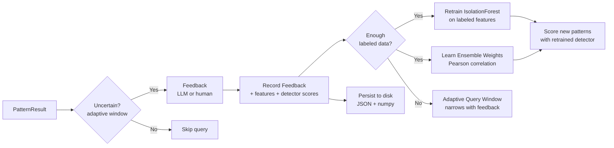

Key features:
- **Feedback-driven retraining**: Accumulates labeled feature vectors and retrains an Isolation Forest anomaly detector when sufficient positive (>= 5) and negative (>= 5) examples exist
- **Ensemble weight learning**: Computes Pearson correlation between per-detector scores and interest labels to learn which detectors best predict interesting patterns
- **Adaptive query strategy**: The uncertainty window (scores where feedback is requested) narrows as more feedback accumulates, focusing queries on the decision boundary
- **Meta-detector feeding**: Labeled samples are forwarded to `MetaDetector.add_sample()` to train the learned scoring model (GBM at 50 labels, neural net at 200 labels)
- **Persistence**: Feedback history, features, and detector scores persist to disk (JSON + numpy) across sessions

### 11.3 BatchProcessor

Processes a list of sky regions sequentially:
- `process_regions(regions)`: fetch + detect + score, sorted by anomaly score
- `process_random(n_regions)`: generate random regions and process
- `process_from_file(path)`: load region list from JSON

---

## 12. Utilities (`utils/`)

### 12.1 RunManager

Creates and manages run directories under `output/runs/{timestamp}/`:

```
output/runs/20260220_143000/
    state.json                 Pipeline state (cycle, status, last checkpoint)
    images/                    Overlay PNGs from _save_finding_images()
    results/                   Per-cycle and aggregate findings JSON
    checkpoints/               Full state snapshots for resume
    reports/                   Text, JSON, mosaic, histogram
```

Methods: `save_checkpoint()`, `load_checkpoint()`, `save_result()`, `load_result()`, `save_image()` (accepts matplotlib Figure or ndarray), `update_state()`.

### 12.2 GPU Detection

`gpu.py` provides transparent GPU/CPU fallback:
- `has_gpu()`: checks `torch.cuda.is_available()`
- `get_device(prefer_gpu)`: returns `torch.device`
- `get_array_module(prefer_gpu)`: returns `(cupy, True)` or `(numpy, False)`
- `gpu_memory_info()`: total/allocated/cached in MB

### 12.3 Retry Logic

`@retry_with_backoff` decorator for API calls:
- Exponential backoff: $\text{delay} = \text{base} \cdot \text{exponential\_base}^\text{attempt}$
- Jitter: $\text{delay} \mathrel{*}= (0.5 + \text{random}())$
- Clamps to `max_delay`
- Supports both sync and async functions
- Configurable retryable exception types

### 12.4 Logging

Structured logging via `get_logger(name)` with format: `timestamp | level | module | message`. Console output by default; file output optional.

---

## 13. CLI Commands

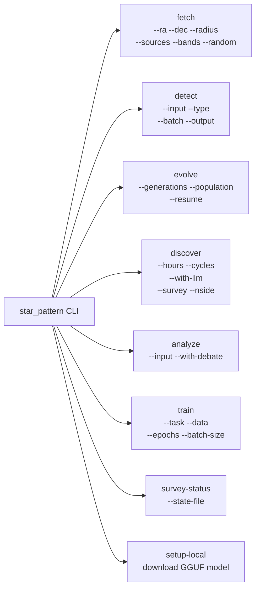

| Command | What It Does |
|---|---|
| `fetch` | Downloads FITS images and catalogs for specified or random regions |
| `detect` | Runs `EnsembleDetector` on FITS files; saves JSON results and overlay PNGs |
| `evolve` | Standalone evolutionary parameter optimization |
| `discover` | Full autonomous discovery loop with optional LLM integration and HEALPix survey mode |
| `analyze` | LLM hypothesis generation and debate on a saved detection |
| `survey-status` | Show HEALPix survey progress from a saved state file |
| `train` | Train lens/morphology/anomaly neural network models |
| `setup-local` | Download and configure local GGUF model for LlamaCpp |

---

## 14. Testing Strategy

419 tests across 30 test files, using real data and real APIs (no mocks):

| Test File | Count | Coverage |
|---|---|---|
| `test_data_sources.py` | 14 | DataCache operations, SkyRegion coordinates, SDSS fetch (real network) |
| `test_detection.py` | 16 | All detectors on synthetic images, ensemble with catalog |
| `test_evaluation.py` | 18 | Metrics, statistical tests, synthetic injection |
| `test_evolution_improvements.py` | 27 | Adaptive mutation, experience replay, synthetic injection fitness, feedback retraining, genome expansion |
| `test_evolutionary.py` | 7 | Presets, population init, selection, generation, short run, real fitness evaluation |
| `test_fits_handler.py` | 11 | FITSImage normalization, tensor conversion, save/load, NaN handling |
| `test_galaxy_detector.py` | 6 | Galaxy tidal features, mergers, color anomalies on synthetic data |
| `test_genome.py` | 15 | Genome creation, mutation, crossover, distance, serialization, 43 genes, 10 presets |
| `test_llm_hypothesis.py` | 7 | Hypothesis generation, debate, consensus, provider discovery (real APIs) |
| `test_pipeline.py` | 66 | RunManager, DiscoveryReport, PipelineConfig, PatternResult, DetectionConfig.from_genome_dict, fitness evaluation, image saving, report generation, Anomaly dataclass, _extract_anomalies, anomaly table formatting, mosaic cutouts |
| `test_proper_motion.py` | 6 | Co-moving groups, runaway stars, stream detection on synthetic catalogs |
| `test_sersic.py` | 15 | Sersic b_n approximation, 1D profile, full analyzer (exponential disk, elliptical, noise, residuals, pixel scale) |
| `test_stellar_population.py` | 10 | CMD analysis, MS/RGB/BS detection, insufficient data, SDSS color fallback |
| `test_transient.py` | 6 | Astrometric noise, parallax anomalies, photometric outliers |
| `test_wavelet.py` | 13 | A-trous convolution, decomposition (perfect reconstruction, point/extended sources), multi-scale detection |
| `test_token_tracker.py` | 12 | Token tracking, budget enforcement, save/load, cached call handling |
| `test_local_classifier.py` | 14 | Rule-based classification, ambiguity/novelty detection, rationale generation |
| `test_local_evaluator.py` | 11 | SNR-based verdicts, significance ratings, detector agreement, LLM escalation |
| `test_strategy.py` | 11 | Strategy sessions, compact summaries, outcome tracking, batch review parsing |
| `test_llm_cache.py` | 9 | Cache hit/miss, TTL expiry, hash determinism, corrupt file handling |
| `test_variability.py` | 18 | Variability indices, Lomb-Scargle, outburst detection, classification, integration |
| `test_ztf_datasource.py` | 6 | ZTF data source name/bands/images, IRSA TAP availability |
| `test_catalog_cache.py` | 13 | CatalogEntry serialization (roundtrip, None mag, complex properties, defaults), DataCache catalog operations (put/get, cache miss, source/region independence, persistence, collision avoidance, clear, large catalog, ZTF light curve roundtrip) |
| `test_feature_fusion.py` | 8 | Feature extraction from detection dicts, missing/errored field handling, batch extraction, correct dimensionality |
| `test_meta_detector.py` | 11 | Linear mode, GBM transition at 50 samples, NN transition at 200, feature importance, serialization |
| `test_compositional.py` | 10 | Each primitive operation with synthetic images, pipeline chaining, scoring methods |
| `test_pipeline_genome.py` | 12 | Random creation, mutation preserves validity (2-5 ops), crossover, serialization, preset loading |
| `test_representation_manager.py` | 6 | CPU fallback initialization, embedding anomaly scoring, BYOL retrain trigger |

Tests requiring network or API keys skip gracefully via `pytest.skip()`.

---

## 15. Key Design Decisions

**Why a genetic algorithm for detection parameters?**
The detection pipeline has 54 parameters with complex interactions. Grid search is intractable (54 dimensions), random search is wasteful, and Bayesian optimization struggles with this many mixed discrete/continuous parameters. A GA naturally handles mixed types, maintains population diversity, and the fitness function can incorporate subjective quality metrics. Adaptive mutation rate and experience replay across runs further improve convergence.

**Why multiple LLM providers?**
No single LLM is best at everything. The adversarial debate assigns different providers to advocate, challenger, and judge roles to avoid self-reinforcing biases. Consensus scoring across providers is more robust than any single provider's rating. Provider fallback means the system stays operational even when one API is rate-limited.

**Why no mocks in tests?**
Mocks verify interface contracts but not actual behavior. Real API calls (with pytest.skip when unavailable) provide actual confidence that integrations function correctly.

**Why SEP over photutils for primary extraction?**
SEP is a C library (Python-wrapped) that processes a 256x256 image in <100ms. Photutils is pure Python and slower, but has more features (PSF photometry, aperture corrections), so it serves as a fallback.

**Why SHA256-keyed cache?**
Astronomical data downloads are slow (seconds to minutes). SHA256 hashing of `(source, ra, dec, radius, band)` produces deterministic, collision-free cache keys. The JSON index allows quick lookups without filesystem scans.

**Why adaptive evolution inline?**
Running evolution as a one-time step produces parameters optimized for whatever images happened to be available at that time. Inline evolution every N cycles continuously adapts parameters to the actual distribution of data being encountered, allowing the pipeline to self-tune as it explores different parts of the sky.

**Why LLM-as-strategist instead of per-detection LLM calls?**
Per-detection LLM calls (hypothesis generation at 2,500 tokens, debate at 15,000 tokens) consumed ~20,700 tokens per cycle. A 1,000-cycle run burned ~20M tokens with low impact on detection quality, since most detections are routine and classifiable by simple rules. The strategist pattern calls the LLM once every 25 cycles (~1,000 tokens) for strategic guidance that improves all subsequent cycles. LocalClassifier and LocalEvaluator handle routine classification at zero cost. Only genuinely ambiguous or novel findings are escalated to the LLM in batch. This achieves ~99% token reduction while increasing LLM impact through strategic influence on detector parameters, ensemble weights, and region selection.

**Why feedback-driven retraining?**
Active learning with simple threshold refinement plateaus quickly. By accumulating labeled feature vectors and retraining an Isolation Forest, the system learns a more nuanced decision boundary than a single threshold. Ensemble weight learning (Pearson correlation between detector scores and interest labels) automatically discovers which detectors are most informative for the user's goals.

**Why a-trous wavelets instead of standard DWT?**
The a-trous (stationary) wavelet transform is the standard in astronomical image processing because it is shift-invariant (unlike decimated DWT), preserves image resolution at all scales, and has perfect reconstruction. The B3 spline kernel $[1,4,6,4,1]/16$ is the canonical choice (Starck & Murtagh 2002). MAD-based noise estimation is robust to source contamination, unlike standard deviation.

**Why Sersic profile fitting?**
The Sersic profile $I(r) = I_e \exp\!\left(-b_n \left[\left(\frac{r}{r_e}\right)^{1/n} - 1\right]\right)$ is the standard parametric model for galaxy morphology. The Sersic index $n$ directly classifies galaxy type: $n \approx 1$ for exponential disks, $n \approx 4$ for de Vaucouleurs ellipticals. Residuals from the smooth model reveal substructure (tidal tails, spiral arms, dust lanes) that other detectors miss.

**Why cross-detector feature fusion?**
The weighted ensemble reduces 13 detector scores to a single scalar, discarding rich intermediate data (CAS values, voronoi_cv, n_overdensities, sersic_n, etc.). Feature fusion preserves ~60 dimensions of detector output, enabling the meta-detector to learn that "high wavelet + low morphology + moderate distribution" means something different from high wavelet alone. All features are already computed by existing detectors -- fusion is pure extraction with zero additional computation.

**Why a learned meta-detector with progressive model complexity?**
A linear ensemble cannot represent cross-detector interactions. But training a neural net on 10 labeled samples would overfit immediately. The progressive approach (linear at 0 labels, GBM at 50, neural net at 200) matches model complexity to available supervision, and the blend_weight gene lets evolution control how much to trust the learned model.

**Why compositional detection pipelines?**
The 13 fixed detectors cannot discover detection strategies they were not coded for. Compositional pipelines ("subtract sersic model, then run wavelet on residual, then threshold at $3\sigma$") emerge from evolution rather than being designed. Variable-length pipeline genomes with structural mutation enable open-ended search over detection strategies.

---

## 16. Hooks System

Claude Code hooks in `.claude/hooks/` enforce project rules at tool-use time:

| Hook | Event | What It Blocks |
|---|---|---|
| `no_emoji.py` | PreToolUse (Edit/Write) | Emoji and unicode symbols in code |
| `no_stubs.py` | PreToolUse (Edit/Write) | Mock imports, stub functions, placeholders |
| `no_secrets_git.py` | PreToolUse (Bash) | `git add -A`, `git add .`, staging of `*.key.txt` |
| `api_error_handling.py` | PreToolUse (Edit/Write) | API calls without try/except/timeout |
| `protect_rules.py` | PreToolUse (Edit/Write) | Deletion or weakening of rules in `claude-code-rules.md` |
| `check_success_claims.py` | Stop | Claims of "working"/"complete" without testing evidence |
| `remind_docs.py` | PostToolUse (Edit/Write) | (Non-blocking) Reminds to update CLAUDE.md/VIBE_HISTORY.md on architecture changes |

---

## 17. Dependencies

### Core

| Package | Purpose |
|---|---|
| numpy, scipy | Numerical computation, statistical tests |
| matplotlib | Plotting, overlays, reports |
| astropy | FITS I/O, WCS, coordinates, units |
| astroquery | SDSS, Gaia TAP+, MAST, SIMBAD, NED queries |
| photutils | Advanced photometry (fallback source extraction) |
| sep | C-accelerated source extraction |
| torch, torchvision | Neural network backbones, training |
| scikit-learn | Isolation Forest, preprocessing |
| openai | OpenAI and xAI API client |
| anthropic | Claude API client |
| google-generativeai | Gemini API client |
| click | CLI framework |
| rich | Terminal formatting (tables, progress) |
| tqdm | Progress bars |
| Pillow | Image I/O |
| requests | HTTP client |

### Optional

| Package | Purpose |
|---|---|
| cupy-cuda12x | GPU array acceleration |
| astropy-healpix | HEALPix sky pixelization for survey mode |
| umap-learn + hdbscan | Dimensionality reduction, clustering |
| llama-cpp-python + huggingface_hub | Local LLM inference |
| reportlab | PDF report generation |
| pytest + black + ruff + mypy | Development tooling |
