# Detection Guide: Pattern Recognition in Star Pattern AI

A comprehensive reference for every pattern detection algorithm in the pipeline, how each works, what it finds, and what the results mean.

---

## Table of Contents

1. [How Detection Works (Overview)](#1-how-detection-works)
2. [Source Extraction](#2-source-extraction)
3. [Classical Pattern Detection](#3-classical-pattern-detection)
4. [Morphology Analysis](#4-morphology-analysis)
5. [Anomaly Detection](#5-anomaly-detection)
6. [Gravitational Lens Detection](#6-gravitational-lens-detection)
7. [Spatial Distribution Analysis](#7-spatial-distribution-analysis)
8. [Galaxy Interaction Detection](#8-galaxy-interaction-detection)
9. [Kinematic Analysis (Proper Motion)](#9-kinematic-analysis)
10. [Transient Detection (Catalog-Based)](#10-transient-detection)
11. [Sersic Profile Fitting](#11-sersic-profile-fitting)
12. [Wavelet Multi-Scale Analysis](#12-wavelet-multi-scale-analysis)
13. [Stellar Population Analysis](#13-stellar-population-analysis)
14. [Time-Domain Variability Analysis](#14-time-domain-variability-analysis)
15. [Temporal Image Differencing (Multi-Epoch)](#15-temporal-image-differencing)
16. [Ensemble Scoring](#16-ensemble-scoring)
17. [Cross-Detector Feature Fusion](#17-cross-detector-feature-fusion)
18. [Learned Meta-Detector](#18-learned-meta-detector)
19. [Compositional Detection Pipelines](#19-compositional-detection-pipelines)
20. [Classification and Evaluation](#20-classification-and-evaluation)
21. [Cross-Reference Validation](#21-cross-reference-validation)

---

## 1. How Detection Works

The `EnsembleDetector` runs 14 independent detectors on every sky region, extracts a ~66-dimensional rich feature vector, and combines scores via both a weighted linear ensemble and a learned meta-detector into a final meta_score. Each detector operates on either:

- **Image data** (FITS): classical, morphology, anomaly, lens, distribution, galaxy, sersic, wavelet
- **Catalog data** (StarCatalog): kinematic, transient, population, variability
- **Multi-epoch images** (EpochImage): temporal (image differencing across epochs from ZTF, MAST, SDSS)
- **Both**: galaxy (image + catalog for color analysis)

Every detector produces a score in [0, 1] where 0 means "nothing interesting" and 1 means "maximally anomalous." The ensemble combines these with configurable weights (tuned by the evolutionary algorithm) to produce a final anomaly_score.

**Data flow for a single region:**

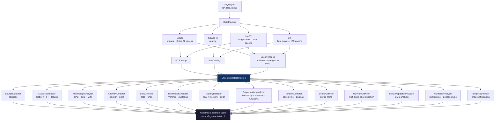
```mermaid
flowchart TD
    REGION[SkyRegion\nRA, Dec, radius] --> DP[DataPipeline]
    DP --> SDSS[SDSS\nimages + Stripe 82 epochs]
    DP --> GAIA[Gaia DR3\ncatalog]
    DP --> MAST[MAST\nimages + HST/JWST epochs]
    DP --> ZTF[ZTF\nlight curves + IBE epochs]

    SDSS --> IMG[FITS Image]
    MAST --> IMG
    GAIA --> CAT[StarCatalog]
    ZTF --> CAT
    SDSS --> EPOCHS[Epoch Images\nmulti-source merged by band]
    MAST --> EPOCHS
    ZTF --> EPOCHS

    IMG --> ENS[EnsembleDetector.detect]
    CAT --> ENS
    EPOCHS --> ENS

    ENS --> SE[SourceExtractor\npositions]
    ENS --> CD[ClassicalDetector\nGabor + FFT + Hough]
    ENS --> MA[MorphologyAnalyzer\nCAS + Gini + M20]
    ENS --> AD[AnomalyDetector\nIsolation Forest]
    ENS --> LD[LensDetector\narcs + rings]
    ENS --> DA[DistributionAnalyzer\nVoronoi + clustering]
    ENS --> GD[GalaxyDetector\ntidal + mergers + color]
    ENS --> PM[ProperMotionAnalyzer\nco-moving + streams + runaways]
    ENS --> TD2[TransientDetector\nastrometric + parallax]
    ENS --> SA[SersicAnalyzer\nprofile fitting]
    ENS --> WA[WaveletAnalyzer\nmulti-scale decomposition]
    ENS --> SPA[StellarPopulationAnalyzer\nCMD analysis]
    ENS --> VA[VariabilityAnalyzer\nlight curves + periodograms]
    ENS --> TEMP[TemporalDetector\nimage differencing]

    SE --> SCORE[Weighted Ensemble Score\nanomaly_score in 0 to 1]
    CD --> SCORE
    MA --> SCORE
    AD --> SCORE
    LD --> SCORE
    DA --> SCORE
    GD --> SCORE
    PM --> SCORE
    TD2 --> SCORE
    SA --> SCORE
    WA --> SCORE
    SPA --> SCORE
    VA --> SCORE
    TEMP --> SCORE

    style ENS fill:#0f3460,color:#e0e0ff
    style SCORE fill:#1a1a2e,color:#e0e0ff
```

---

## 2. Source Extraction

**File:** `detection/source_extraction.py`
**Class:** `SourceExtractor`
**Detects:** Individual point and extended sources (stars, galaxies) in FITS images.

Source extraction is not a pattern detector itself but provides the positions, fluxes, and morphological parameters that feed into the distribution analyzer and other detectors.

### Algorithm Flow

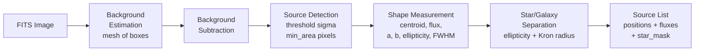
```mermaid
flowchart LR
    IMG[FITS Image] --> BG[Background\nEstimation\nmesh of boxes]
    BG --> SUB[Background\nSubtraction]
    SUB --> DET[Source Detection\nthreshold sigma\nmin_area pixels]
    DET --> SHAPE[Shape Measurement\ncentroid, flux,\na, b, ellipticity, FWHM]
    SHAPE --> CLASS[Star/Galaxy\nSeparation\nellipticity + Kron radius]
    CLASS --> OUT[Source List\npositions + fluxes\n+ star_mask]
```

Uses the SEP library (C-accelerated Python wrapper around SExtractor) as the primary method, with photutils DAOStarFinder as fallback.

**Step 1: Background Estimation**
SEP estimates a spatially varying background model using a mesh of boxes across the image. The background is subtracted before source detection.

**Step 2: Source Detection**
Sources are identified as connected groups of pixels exceeding `threshold` sigma above the local background. Each group must have at least `min_area` contiguous pixels (default 5).

**Step 3: Shape Measurement**
For each source, SEP computes:
- Centroid position (x, y)
- Flux (sum of background-subtracted pixel values)
- Semi-major and semi-minor axes (a, b) from second moments
- Ellipticity: $e = 1 - b/a$
- FWHM: $2\sqrt{\ln 2 \cdot (a^2 + b^2)}$

**Step 4: Star/Galaxy Separation**
A simple classifier uses two criteria:
- Ellipticity < 0.3 (round objects are likely stars)
- Kron radius < 1.5x the median (compact objects are likely stars)

Sources meeting both criteria are classified as stars; the rest as galaxies.

### Output

```
n_sources: 347
positions: array of (x, y) pixel coordinates
fluxes: array of integrated fluxes
ellipticity: array of shape parameters
fwhm: array of sizes in pixels
star_mask: boolean array (True = star)
background_rms: 12.3 (noise level)
```

### Parameters

| Parameter | Default | Range (Genome) | Effect |
|---|---|---|---|
| `threshold` | 3.0 sigma | 1.5 - 10.0 | Lower = more sources (including noise); higher = fewer, brighter sources |
| `min_area` | 5 pixels | 3 - 20 | Minimum contiguous pixel area to count as a source |

### Example: What This Looks Like

A typical SDSS r-band image of 256x256 pixels at 0.396"/pixel yields 50-500 sources depending on the field density. A crowded field near the Galactic plane may have thousands; a high-latitude empty field may have fewer than 20.

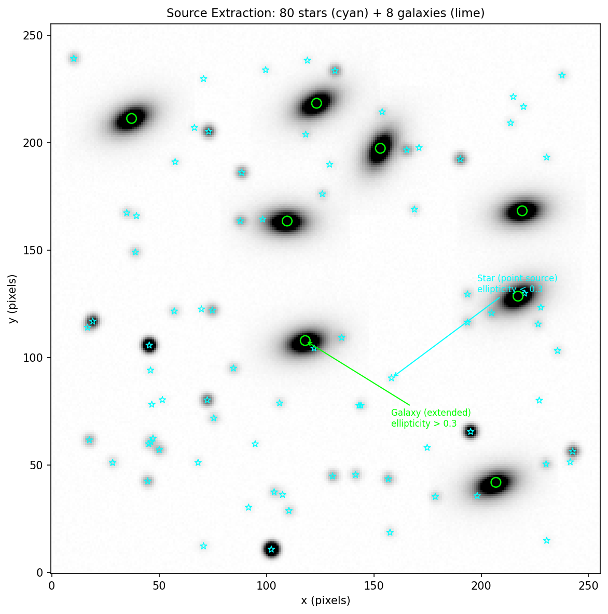

*Synthetic starfield with 80 detected stars (cyan markers) and 8 extended galaxies (lime circles). Stars are classified by ellipticity < 0.3 and compact Kron radius. Galaxies are more extended and/or elongated.*

---

## 3. Classical Pattern Detection

**File:** `detection/classical.py`
**Class:** `ClassicalDetector`
**Detects:** Spatial frequency patterns (Gabor filters), dominant spatial scales (FFT), and arc/circle features (Hough transform).

### Algorithm Flow

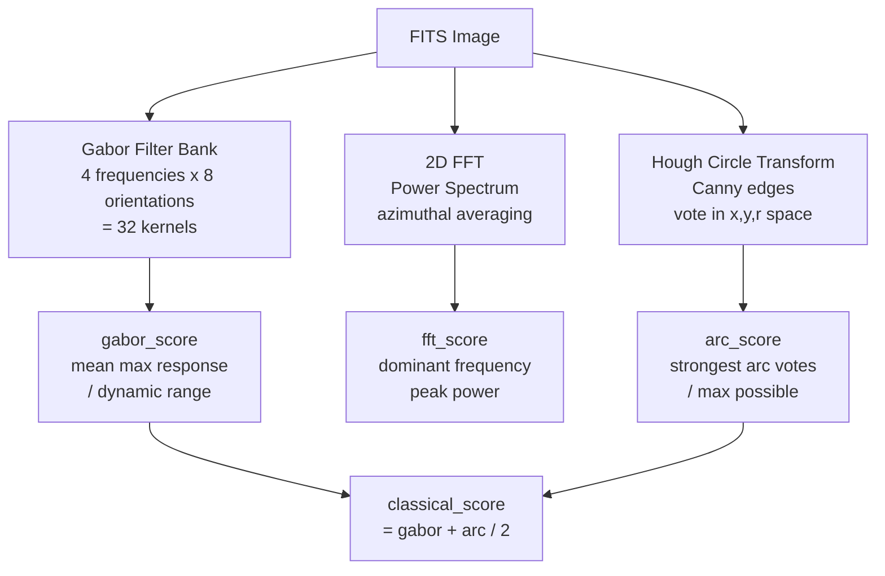
```mermaid
flowchart TD
    IMG[FITS Image] --> GABOR[Gabor Filter Bank\n4 frequencies x 8 orientations\n= 32 kernels]
    IMG --> FFT[2D FFT\nPower Spectrum\nazimuthal averaging]
    IMG --> HOUGH[Hough Circle Transform\nCanny edges\nvote in x,y,r space]

    GABOR --> GS[gabor_score\nmean max response\n/ dynamic range]
    FFT --> FS[fft_score\ndominant frequency\npeak power]
    HOUGH --> AS[arc_score\nstrongest arc votes\n/ max possible]

    GS --> CS[classical_score\n= gabor + arc / 2]
    AS --> CS
```

### Gabor Filter Bank

Gabor filters detect directional texture at specific spatial frequencies. Each filter is a sinusoidal grating modulated by a Gaussian envelope, sensitive to patterns at a particular orientation and scale.

**Configuration:**
- 4 frequencies: [0.05, 0.1, 0.2, 0.4] cycles/pixel (genome-tunable)
- 8 orientations: 0, 22.5, 45, 67.5, 90, 112.5, 135, 157.5 degrees
- Total: 32 filter kernels

**Computation:**
For each kernel, the filter response is computed via FFT convolution. The maximum response across all orientations at each pixel gives the dominant direction. The mean energy across all responses measures the overall texture strength.

**Score:** $\text{gabor\_score} = \frac{\text{mean}(\max\_\text{response\_per\_pixel})}{\text{dynamic\_range}}$

A high gabor_score means the image has strong directional patterns (spiral arms, diffraction spikes, gravitational arcs).

### FFT Power Spectrum

The 2D Fourier transform reveals dominant spatial frequencies in the image.

**Computation:**
1. Compute 2D FFT and shift zero-frequency to center
2. Power spectrum: $P(u,v) = |F(u,v)|^2$
3. Azimuthally average into radial bins to get `P(k)` vs spatial frequency `k`
4. Mask DC component and lowest frequencies (first 3 bins)
5. Find dominant frequency peak

**Score:** The dominant frequency value (normalized). A strong peak indicates a repeating pattern at a specific scale.

### Hough Arc Detection

The Hough Circle Transform detects circular arcs in the image.

**Computation:**
1. Downsample to max 512 pixels (for speed)
2. Edge detection via Canny: Sobel gradients, threshold at 95th percentile
3. Subsample edge points to 5000 maximum
4. Vote in (x, y, r) parameter space with 72 angular steps (5-degree resolution)
5. Threshold at 50% of maximum accumulator value
6. Return top 20 candidate arcs sorted by vote strength

**Score:** $\text{arc\_score} = \text{strongest\_arc\_votes} / \text{max\_possible\_votes}$

**Final:** $\text{classical\_score} = (\text{gabor\_score} + \text{arc\_score}) / 2$

### Example: What This Finds

- **Spiral galaxy arms**: Strong Gabor response at medium frequencies in specific orientations
- **Diffraction patterns**: High FFT peak at the frequency of the diffraction spike spacing
- **Gravitational arcs**: Hough circle detections at radii consistent with Einstein rings
- **Regularly spaced star clusters**: FFT peak at the inter-cluster spacing frequency

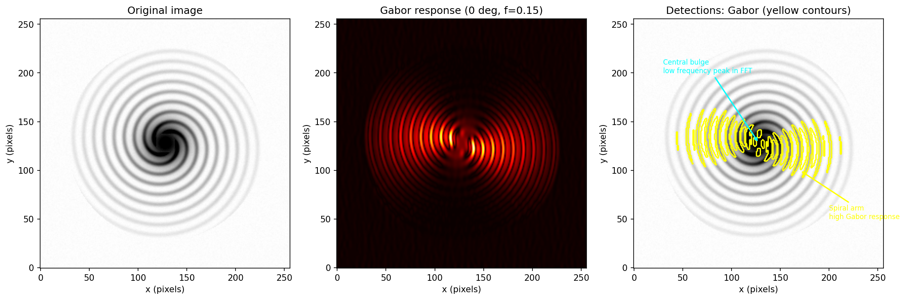

*Left: Synthetic spiral galaxy image. Center: Gabor filter response at 0 degrees and f=0.15 cycles/pixel, showing strong response along the spiral arms. Right: Detection overlay with yellow contours marking regions of high Gabor response, plus annotations for the central bulge (FFT peak) and spiral arm features.*

---

## 4. Morphology Analysis

**File:** `detection/morphology.py`
**Class:** `MorphologyAnalyzer`
**Detects:** Non-parametric morphological anomalies using the CAS system and Gini/M20 statistics.

These are standard galaxy morphology metrics used throughout extragalactic astronomy.

### Concentration (C)

Measures how centrally concentrated the light is.

**Formula:** $C = 5 \log_{10}(r_{80} / r_{20})$

Where r20 and r80 are the radii containing 20% and 80% of the total flux. Computed from the center of mass outward. Typical values:
- Elliptical galaxies: C ~ 4-5 (very concentrated)
- Spiral galaxies: C ~ 2.5-3.5
- Irregular/merging: C < 2.5

### Asymmetry (A)

Measures how different the image looks when rotated 180 degrees.

**Formula:** $$A = \frac{\sum |I - I_{180}|}{2 \sum |I|}$$

Where I_180 is the image rotated by 180 degrees. Typical values:
- Symmetric ellipticals: A < 0.05
- Normal spirals: A ~ 0.1-0.2
- Mergers/interactions: A > 0.3
- Strongly disturbed: A > 0.5

### Smoothness (S)

Measures clumpiness -- how much substructure exists beyond the smooth component.

**Formula:** $$S = \frac{\sum |I - I_\text{smooth}|}{\sum |I|}$$

Where I_smooth is the image convolved with a Gaussian of sigma=3 pixels. High S indicates star-forming clumps, tidal debris, or spiral arm substructure.

### Gini Coefficient (G)

Measures inequality of pixel flux values. Borrowed from economics.

**Formula:** $$G = \frac{2 \sum_{i} i \cdot f_{\text{sorted}}[i]}{n \sum f} - \frac{n+1}{n}$$

Where f_sorted is the sorted array of pixel fluxes. Range [0, 1]:
- G ~ 0.3-0.4: uniform surface brightness (irregular galaxies)
- G ~ 0.5-0.6: typical spirals/ellipticals
- G > 0.6: concentrated or point-like (QSOs, compact galaxies)

### M20 Statistic

Second-order moment of the brightest 20% of pixels.

**Formula:** $$M_{20} = \log_{10}\!\left(\frac{\sum_{\text{brightest 20\%}} f \cdot d^2}{\sum_{\text{all}} f \cdot d^2}\right)$$

Where d is distance from center of mass. More negative M20 means the brightest pixels are more centrally concentrated.

### Morphology Score

$$\begin{aligned}
\text{score} &= 0.3 \cdot \min(3A,\; 1) \\
&+ 0.25 \cdot G \\
&+ 0.2 \cdot S \\
&+ 0.15 \cdot \frac{|C - 3|}{3} \\
&+ 0.1 \cdot \text{ellipticity}
\end{aligned}$$

### Example: What This Finds

- **Galaxy mergers**: Very high A (>0.3), moderate G, high S from tidal debris
- **Compact ellipticals**: Very high C and G, low A and S
- **Edge-on spirals**: High ellipticity, moderate CAS
- **Irregular galaxies**: Low C, moderate A, high S, low G

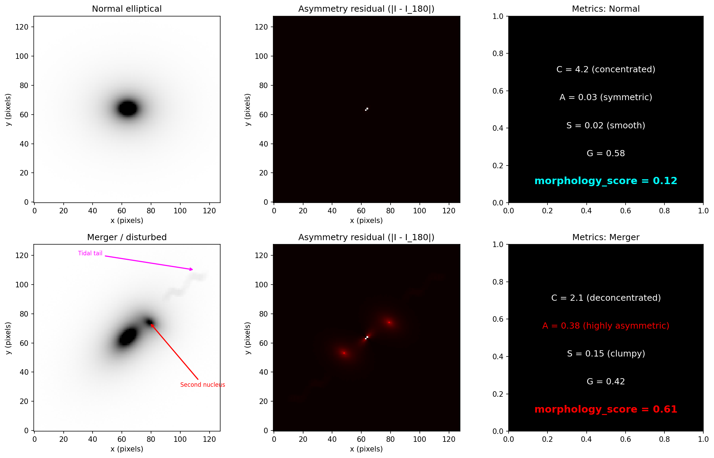

*Top row: Normal elliptical galaxy with low asymmetry (A=0.03), smooth profile, and morphology_score=0.12. Bottom row: Galaxy merger with second nucleus, tidal tail, high asymmetry (A=0.38), and morphology_score=0.61. The asymmetry residual (center column) reveals structure invisible in the raw image: the merger shows strong residuals while the elliptical is nearly clean.*

---

## 5. Anomaly Detection

**File:** `detection/anomaly.py`
**Class:** `AnomalyDetector`
**Detects:** Statistical outliers in the combined feature space of all other detectors.

This detector operates on the score vector from all other detectors, flagging images whose pattern of detector responses is unusual compared to the population.

### Algorithm Flow

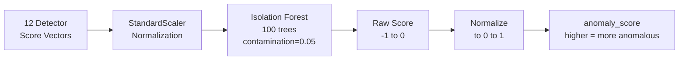
```mermaid
flowchart LR
    SCORES[12 Detector\nScore Vectors] --> SCALE[StandardScaler\nNormalization]
    SCALE --> IF[Isolation Forest\n100 trees\ncontamination=0.05]
    IF --> RAW[Raw Score\n-1 to 0]
    RAW --> NORM[Normalize\nto 0 to 1]
    NORM --> OUT[anomaly_score\nhigher = more anomalous]
```

### Algorithm: Isolation Forest

The Isolation Forest works by randomly partitioning the feature space with binary trees. Anomalies are isolated quickly (shallow trees) because they are few and different from the majority.

**Training:**
- StandardScaler normalization of features
- 100 decision trees (genome-tunable)
- Contamination parameter = 0.05 (expected fraction of anomalies)

**Scoring:**
- Raw score range: [-1, 0] (more negative = more anomalous)
- Normalized to [0, 1]: $\text{score} = \frac{\max_\text{raw} - \text{raw}}{\max_\text{raw} - \min_\text{raw}}$

**Fallback (single image):**
When only one sample is available (common in the pipeline), the detector falls back to a distance-from-mean metric: how far the feature vector is from the centroid, normalized by the maximum observed distance.

### Example: What This Finds

A region where the lens detector scores 0.7 but all other detectors score near 0 is anomalous -- most regions have either all-low or all-moderate scores. The anomaly detector flags unusual combinations of detector responses.

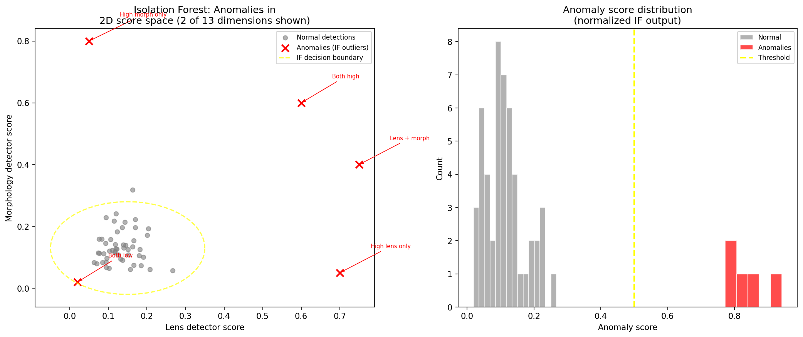

*Left: Isolation Forest decision boundary in 2D score space (showing 2 of 13 dimensions). Normal detections cluster in the low-score region; anomalies (red crosses) are isolated by the forest because they occupy unusual positions in detector score space. Right: The resulting anomaly score distribution, with a threshold separating normal from anomalous.*

---

## 6. Gravitational Lens Detection

**File:** `detection/lens_detector.py`
**Class:** `LensDetector`
**Detects:** Gravitational lensing signatures: tangential arcs, Einstein rings, and strong-lens candidates.

Gravitational lensing occurs when a massive foreground object (galaxy, cluster) bends light from a background source. This produces characteristic arcs and rings around the lensing mass.

### Algorithm Flow

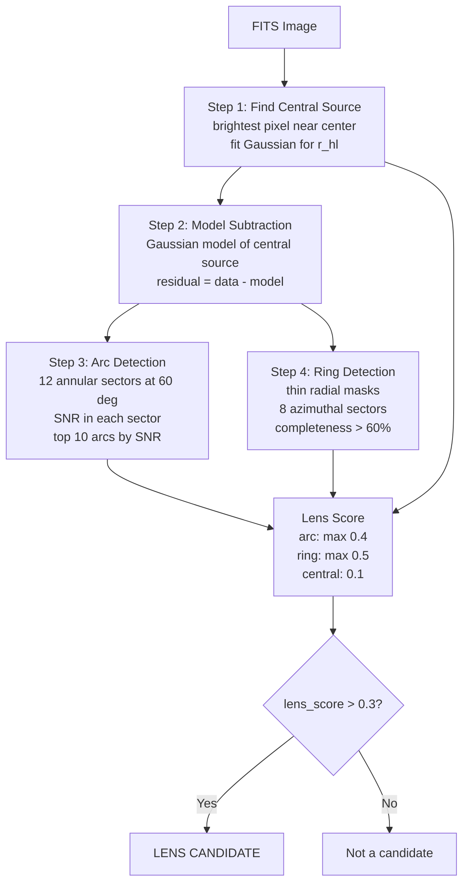
```mermaid
flowchart TD
    IMG[FITS Image] --> CS[Step 1: Find Central Source\nbrightest pixel near center\nfit Gaussian for r_hl]
    CS --> SUB[Step 2: Model Subtraction\nGaussian model of central source\nresidual = data - model]
    SUB --> ARC[Step 3: Arc Detection\n12 annular sectors at 60 deg\nSNR in each sector\ntop 10 arcs by SNR]
    SUB --> RING[Step 4: Ring Detection\nthin radial masks\n8 azimuthal sectors\ncompleteness > 60%]
    ARC --> SCORE[Lens Score\narc: max 0.4\nring: max 0.5\ncentral: 0.1]
    RING --> SCORE
    CS --> SCORE
    SCORE --> CAND{lens_score > 0.3?}
    CAND -- Yes --> LENS[LENS CANDIDATE]
    CAND -- No --> SKIP[Not a candidate]
```

### Step 1: Central Source Identification

Find the brightest object near the image center as the candidate lensing mass.
- Smooth image with Gaussian (sigma=3 pixels)
- Find brightest pixel in the central region
- Fit Gaussian to estimate half-light radius (r_hl)
- Work in a cutout around this source for efficiency

### Step 2: Central Source Model Subtraction

Build a Gaussian model of the central source and subtract it to reveal faint arc/ring residuals:

$$I_\text{model}(r) = I_\text{peak} \cdot \exp\!\left(-\frac{1}{2}\left(\frac{r}{r_\text{hl}}\right)^2\right)$$

$$\text{residual} = \text{data} - I_\text{model}$$

### Step 3: Arc Detection

Search for arcs in annular sectors around the central source:
- Divide each annulus into 12 sectors of 60 degrees each
- For each sector at each radius:
  - Measure SNR of residual within the sector
  - Flag sectors with SNR > 3.0 (configurable)
- Adaptive radius stepping: max(5, range/20) pixels
- Keep top 10 arcs by SNR

**What an arc looks like:** A bright elongated feature curving around the central source at a specific radius, visible in one or a few adjacent sectors.

### Step 4: Ring Detection

Search for complete or partial Einstein rings:
- Check narrow rings at each radius (r +/- 2 pixels)
- Divide into 8 azimuthal sectors
- Measure SNR in each sector
- Completeness = fraction of sectors with SNR > background RMS
- Flag rings with completeness > 60%

**What a ring looks like:** A nearly circular feature around the central source, visible in most azimuthal sectors. Partial rings (75% completeness) are common; complete rings are rare.

### Lens Score

$$\begin{aligned}
\text{arc\_contribution} &= \min(\text{best\_arc\_snr} / 10,\; 0.4) \\
\text{ring\_contribution} &= \min(\text{best\_ring\_snr} / 10,\; 0.3) + 0.2 \text{ if complete} \\
\text{central\_bonus} &= 0.1 \text{ if bright central source present} \\
\text{lens\_score} &= \text{clip}(\text{sum},\; 0,\; 1) \\
\text{is\_candidate} &= \text{lens\_score} > 0.3
\end{aligned}$$

### Parameters

| Parameter | Default | Range (Genome) | Effect |
|---|---|---|---|
| `arc_min_length` | 15 px | 8 - 30 | Minimum arc length to count as detection |
| `arc_max_width` | 8 px | 3 - 15 | Maximum arc thickness |
| `ring_min_radius` | 10 px | 5 - 30 | Inner search radius for rings |
| `ring_max_radius` | 80 px | 30 - 120 | Outer search radius for rings |
| `snr_threshold` | 3.0 | 1.5 - 5.0 | Minimum SNR for arc/ring detection |

### Example: What This Finds

- **Strong lens (score > 0.5):** A bright elliptical galaxy at center with one or more blue arcs curving around it at 2-5 arcsec radius. Famous examples: Horseshoe Lens, Einstein Cross.
- **Moderate candidate (0.3-0.5):** Possible arc feature but noisy, or an incomplete ring.
- **False positives:** Satellite trails, diffraction spikes near bright stars, PSF wings.

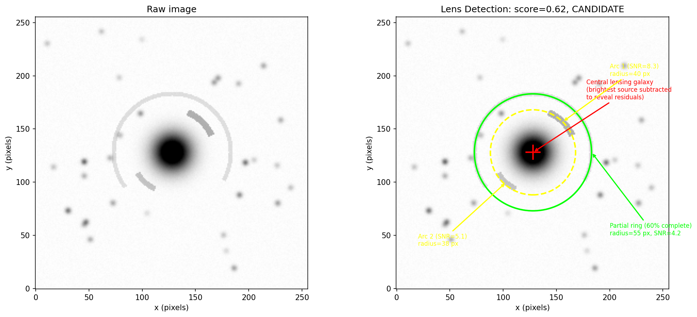

*Left: Raw synthetic image with a central lensing galaxy and two gravitational arcs plus a partial Einstein ring. Right: Annotated detection showing the central source (red cross), arc detections at radii 38-40 px (yellow dashed circles with SNR labels), and a partial ring at 55 px (lime circle, 60% azimuthal completeness). Score=0.62, classified as LENS CANDIDATE.*

---

## 7. Spatial Distribution Analysis

**File:** `detection/distribution.py`
**Class:** `DistributionAnalyzer`
**Detects:** Non-random spatial distributions of sources: clustering, voids, streams, overdensities.

Requires at least 10 extracted source positions to operate (otherwise skipped).

### Voronoi Tessellation

The Voronoi diagram partitions the plane into cells, one per source, where each cell contains the points closer to its source than to any other. Cell areas reveal clustering.

**Metric:** Coefficient of variation $\text{CV} = \sigma(\text{cell\_areas}) / \mu(\text{cell\_areas})$

- CV = 0.53: expected for a random Poisson distribution
- CV >> 0.53: clustered (small cells near clusters, large cells in voids)
- CV << 0.53: unusually uniform (repulsive process)

**Clustering excess:** $\max(\text{CV} - 0.53,\; 0)$

### Two-Point Correlation Function (TPCF)

Measures the excess probability of finding a pair of sources at separation r, compared to a random distribution.

**Formula:** $w(r) = \frac{DD(r)}{RR(r)} - 1$

Where DD(r) is the count of data-data pairs in radial bin r, and RR(r) is the expected count for a Poisson distribution with the same mean density.

- w(r) > 0: excess clustering at scale r
- w(r) = 0: random
- w(r) < 0: under-density at scale r

### Clark-Evans Nearest-Neighbor Statistic

A single number summarizing the degree of clustering.

**Formula:** $R = \frac{\bar{d}_\text{obs}}{d_\text{exp}}$

Where $d_\text{exp} = 0.5 / \sqrt{\rho}$ for a Poisson process.

- R < 1: sources are closer together than expected (clustered)
- R = 1: random distribution
- R > 1: sources are more evenly spaced than random (regular/inhibited)

### Overdensity Detection

Uses kernel density estimation (KDE) on a 50x50 grid:
1. Gaussian KDE of source positions
2. Threshold: mean + 3 sigma
3. Connected component labeling above threshold
4. Top 10 overdensities by peak significance

### Distribution Score

$$\begin{aligned}
\text{score} &= \min(\text{CV\_excess} / 0.5,\; 0.3) \\
&+ \min(\text{tpcf\_amplitude} / 2,\; 0.3) \\
&+ \min(|R_\text{CE} - 1| / 0.5,\; 0.2) \\
&+ \min(\max\_\text{overdensity\_sigma} / 10,\; 0.2)
\end{aligned}$$

### Example: What This Finds

- **Star clusters:** High CV (>1.0), strong TPCF at small scales, R << 1, overdensities with high sigma
- **Galaxy clusters:** Same pattern but with larger characteristic scale
- **Voids:** Low source density regions surrounded by higher density
- **Streams/filaments:** Directional clustering visible in the TPCF and Voronoi tessellation

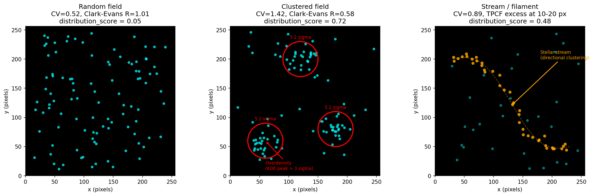

*Three spatial distribution patterns. Left: Random (Poisson) field with CV=0.52 and Clark-Evans R=1.01 (score=0.05, nothing unusual). Center: Clustered field with three overdensities circled in red at 5.2 sigma significance, CV=1.42, R=0.58 (score=0.72, strong clustering). Right: Stellar stream/filament (orange points) with directional clustering visible in TPCF excess at 10-20 px scales (score=0.48).*

---

## 8. Galaxy Interaction Detection

**File:** `detection/galaxy_detector.py`
**Class:** `GalaxyDetector`
**Detects:** Tidal features (tails, bridges, shells), merger candidates (double nuclei), and photometric color anomalies.

### Algorithm Flow

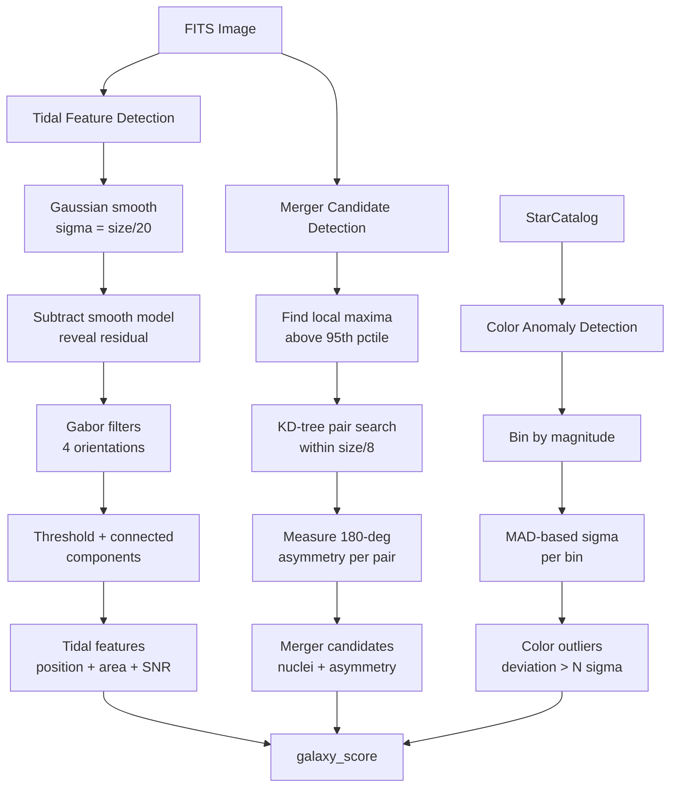
```mermaid
flowchart TD
    IMG[FITS Image] --> TIDAL[Tidal Feature Detection]
    IMG --> MERGER[Merger Candidate Detection]
    CAT[StarCatalog] --> COLOR[Color Anomaly Detection]

    TIDAL --> T1[Gaussian smooth\nsigma = size/20]
    T1 --> T2[Subtract smooth model\nreveal residual]
    T2 --> T3[Gabor filters\n4 orientations]
    T3 --> T4[Threshold + connected\ncomponents]
    T4 --> TF[Tidal features\nposition + area + SNR]

    MERGER --> M1[Find local maxima\nabove 95th pctile]
    M1 --> M2[KD-tree pair search\nwithin size/8]
    M2 --> M3[Measure 180-deg\nasymmetry per pair]
    M3 --> MC[Merger candidates\nnuclei + asymmetry]

    COLOR --> C1[Bin by magnitude]
    C1 --> C2[MAD-based sigma\nper bin]
    C2 --> CO[Color outliers\ndeviation > N sigma]

    TF --> GS[galaxy_score]
    MC --> GS
    CO --> GS
```

### Tidal Feature Detection

Tidal features are low-surface-brightness structures produced by gravitational interactions between galaxies.

**Algorithm:**
1. Heavy Gaussian smoothing (sigma = image_size/20) to build a smooth model
2. Subtract smooth model to reveal residual structure
3. Compute local SNR map (residual / local RMS noise)
4. Apply Gabor filters at 4 orientations (0, 45, 90, 135 degrees) to detect directional features
5. Threshold: `tidal_threshold * max(|response|)` (default 0.3)
6. Connected component analysis: require area > 2*sigma pixels
7. Deduplicate features within sigma distance

**What tidal features look like:** Faint, elongated streams extending from the main galaxy body. Tidal tails can extend 50-100 kpc (tens of arcseconds at typical distances). Shells are concentric arc-shaped features from minor mergers.

### Merger Candidate Detection

**Algorithm:**
1. Gaussian smooth (sigma=2), find local maxima above 95th percentile
2. Cap peaks at 200 (prevents O(n^2) explosion in crowded fields)
3. KD-tree pair search within max_separation = image_size/8
4. For each pair, measure 180-degree rotation asymmetry in a cutout:
   - $A = \sum |I - I_{180}| / (2 \sum |I|)$
5. Flag pairs with asymmetry > 0.35 (configurable) and flux ratio < 10:1
6. Cap output at 50 candidates sorted by asymmetry

**What mergers look like:** Two bright nuclei within a shared envelope, separated by a few arcseconds, with disturbed morphology (high asymmetry). The more asymmetric, the more advanced the merger.

### Color Anomaly Detection

**Algorithm:**
1. Extract BP-RP (Gaia) or g-r (SDSS) colors from catalog entries
2. Bin sources by magnitude (n_bins = max(3, N/20))
3. In each bin, compute median color and robust scatter (MAD-based)
4. Flag sources with |color - median| > color_sigma * std (default 2.5 sigma)

**What color anomalies indicate:** A star or galaxy whose color deviates significantly from the field population at the same brightness. This can indicate:
- Active galactic nuclei (AGN) -- bluer than expected
- Dust-reddened objects -- redder than expected
- Unresolved binary stars with mismatched components
- Background quasars seen through the field

### Galaxy Score

$$\begin{aligned}
\text{score} &= 0.3 \cdot \min(n_\text{tidal} / 3,\; 1) \\
&+ 0.4 \cdot \min(n_\text{mergers} / 2,\; 1) \\
&+ 0.3 \cdot \min(n_\text{color\_outliers} / 5,\; 1)
\end{aligned}$$

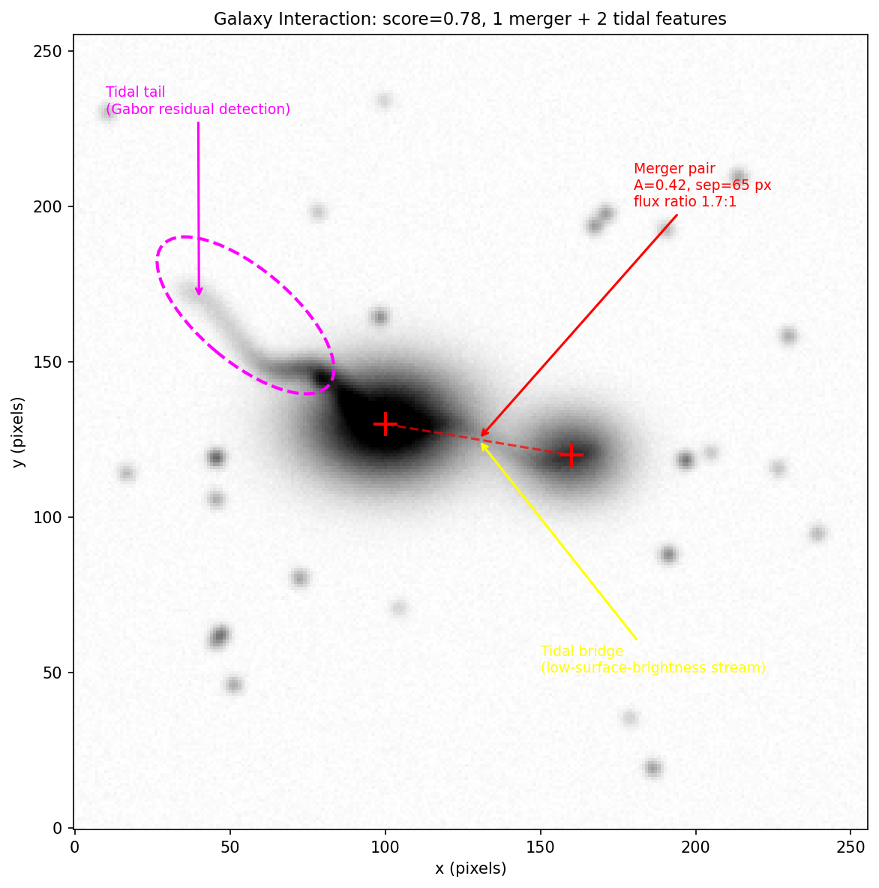

*Synthetic interacting galaxy pair. Red crosses and dashed line mark the merger pair (two nuclei separated by 65 px, asymmetry A=0.42, flux ratio 1.7:1). Magenta ellipse outlines a tidal tail extending from the primary galaxy (detected via Gabor residual analysis). Yellow annotation marks the faint tidal bridge connecting the two galaxies. Score=0.78 with 1 merger candidate and 2 tidal features.*

---

## 9. Kinematic Analysis

**File:** `detection/proper_motion.py`
**Class:** `ProperMotionAnalyzer`
**Detects:** Co-moving stellar groups, stellar streams, and runaway stars from proper motion data.

Operates on catalog entries with proper motion (pmra, pmdec) from Gaia DR3.

### Algorithm Flow

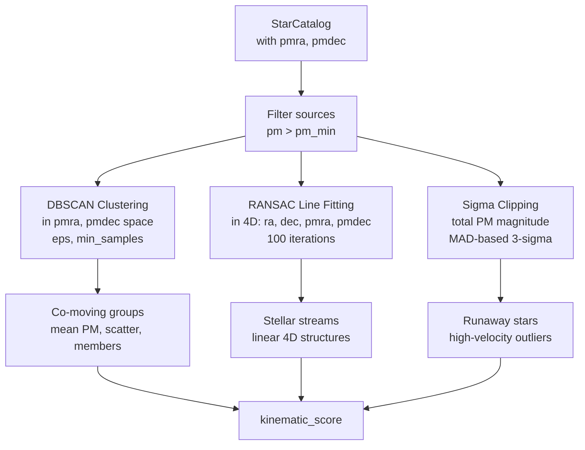
```mermaid
flowchart TD
    CAT[StarCatalog\nwith pmra, pmdec] --> FILTER[Filter sources\npm > pm_min]
    FILTER --> DBSCAN[DBSCAN Clustering\nin pmra, pmdec space\neps, min_samples]
    FILTER --> RANSAC[RANSAC Line Fitting\nin 4D: ra, dec, pmra, pmdec\n100 iterations]
    FILTER --> SIGMA[Sigma Clipping\ntotal PM magnitude\nMAD-based 3-sigma]

    DBSCAN --> GROUPS[Co-moving groups\nmean PM, scatter, members]
    RANSAC --> STREAMS[Stellar streams\nlinear 4D structures]
    SIGMA --> RUNAWAYS[Runaway stars\nhigh-velocity outliers]

    GROUPS --> KS[kinematic_score]
    STREAMS --> KS
    RUNAWAYS --> KS
```

### Co-Moving Group Detection

Stars born together share the same space velocity, so they cluster in proper motion space even when dispersed across the sky.

**Algorithm:** DBSCAN clustering in 2D proper motion space (pmra, pmdec)
- eps = 2.0 mas/yr (default, genome-tunable): maximum PM separation within a group
- min_samples = 5 (default): minimum members for a valid group

**Output per group:** Mean proper motion, scatter, sky position, member IDs. Groups of stars moving together at the same velocity are physically associated: open clusters, moving groups, or dissolving associations.

### Stellar Stream Detection

Tidal streams from disrupted star clusters or dwarf galaxies form linear structures in the combined position+velocity space.

**Algorithm:** RANSAC-like fitting in 4D (ra, dec, pmra, pmdec):
1. Normalize all dimensions to unit variance
2. 100 random iterations: pick 2 points, fit a line, count inliers
3. Inlier threshold: residual < 0.5 in normalized units
4. Keep the best fit with at least `stream_min_length` members (default 8)

**What streams look like:** A chain of stars aligned in both position and proper motion direction. Famous examples: the Sagittarius stream, Palomar 5 tidal tails.

### Runaway Star Detection

Stars ejected from binary systems or cluster cores at high velocity.

**Algorithm:**
1. Compute total proper motion: $\text{pm} = \sqrt{\text{pmra}^2 + \text{pmdec}^2}$
2. Robust sigma: $\sigma_\text{robust} = 1.4826 \cdot \text{median}(|\text{pm} - \text{median}(\text{pm})|)$ (MAD estimator)
3. Flag stars with deviation > 3 sigma AND pm > pm_min (default 5 mas/yr)

**What runaways look like:** Isolated stars with proper motions much larger than the field average, often tracing back to a known cluster or binary origin.

### Kinematic Score

$$\begin{aligned}
\text{score} &= 0.4 \cdot \min(n_\text{comoving} / 3,\; 1) \\
&+ 0.35 \cdot \min(n_\text{streams} / 2,\; 1) \\
&+ 0.25 \cdot \min(n_\text{runaways} / 5,\; 1)
\end{aligned}$$

### Parameters

| Parameter | Default | Range (Genome) | Effect |
|---|---|---|---|
| `kinematic_pm_min` | 5.0 mas/yr | 1.0 - 20.0 | Minimum PM for analysis; too low catches noise |
| `kinematic_cluster_eps` | 2.0 mas/yr | 0.5 - 10.0 | DBSCAN neighborhood size; smaller = tighter groups |
| `kinematic_cluster_min` | 5 | 3 - 15 | Min members per group; smaller = more detections |
| `kinematic_stream_min_length` | 8 | 5 - 20 | Min stars in a stream; smaller = more (noisier) streams |

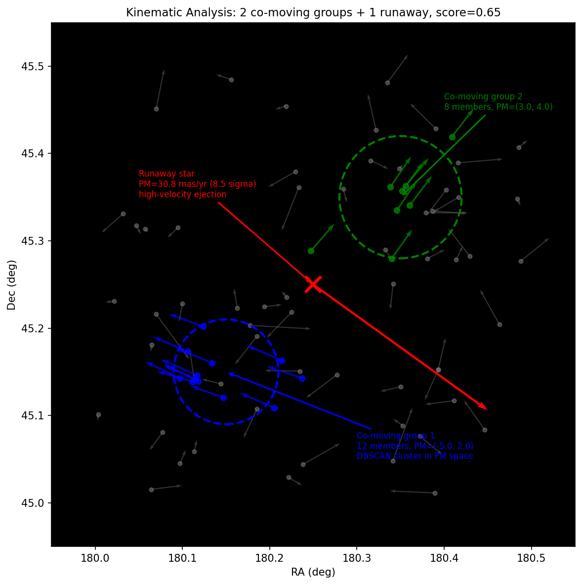

*Proper motion vector field for a synthetic field. Gray arrows show random field star motions. Blue: co-moving group 1 (12 members, all sharing PM=(-5.0, 2.0) mas/yr, detected via DBSCAN). Green: co-moving group 2 (8 members, PM=(3.0, 4.0) mas/yr). Red cross: runaway star with PM=30.8 mas/yr (8.5 sigma above the field median), detected via MAD-based sigma clipping. Score=0.65.*

---

## 10. Transient Detection

**File:** `detection/transient.py`
**Class:** `TransientDetector`
**Detects:** Variability indicators from static catalog properties: astrometric excess noise, photometric outliers, parallax anomalies.

Note: This detector operates on catalog-level summary statistics (e.g., from Gaia DR3), not on multi-epoch time series. For actual light curve analysis, see [Section 14: Variability Analysis](#14-time-domain-variability-analysis).

### Astrometric Excess Noise

Gaia's astrometric solution fits a 5-parameter model (position, proper motion, parallax) to each source. When the fit is poor, the residual is captured as "astrometric excess noise."

High excess noise indicates:
- Unresolved binary stars (photocenter wobble)
- Extended objects (galaxies resolved by Gaia)
- Variability (photocenter shifts with brightness changes)

**Detection:** Flag sources with noise > 3 sigma above the field median (MAD-based robust sigma).

### Photometric Outliers

Sources whose color deviates from the field population at the same magnitude.

**Detection:** Same binned color analysis as the galaxy detector, but operating on all catalog sources (not just those near a galaxy). Uses MAD-based robust statistics.

### Parallax Anomalies

**Detection:** Flags two types:
- Negative parallax: indicates the source is far beyond Gaia's reliable parallax measurement range, possibly a background quasar or high-redshift galaxy
- Low parallax SNR: parallax_error > parallax / parallax_snr_threshold

### Transient Score

$$\begin{aligned}
\text{score} &= 0.4 \cdot \min(n_\text{astrometric} / 5,\; 1) \\
&+ 0.3 \cdot \min(n_\text{photometric} / 5,\; 1) \\
&+ 0.3 \cdot \min(n_\text{parallax} / 5,\; 1)
\end{aligned}$$

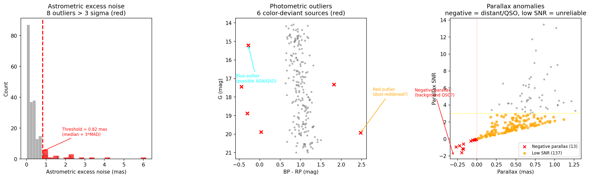

*Three catalog-level anomaly indicators. Left: Astrometric excess noise distribution with 8 outliers (red) exceeding 3-sigma threshold -- these may be unresolved binaries or AGN with photocenter wobble. Center: Color-magnitude diagram with 6 photometric outliers (red crosses) deviating from the field color-magnitude relation -- blue outliers may be AGN/QSOs, red outliers may be dust-reddened. Right: Parallax anomalies showing negative-parallax sources (red, likely distant QSOs) and low-SNR sources (orange, unreliable astrometry).*

---

## 11. Sersic Profile Fitting

**File:** `detection/sersic.py`
**Class:** `SersicAnalyzer`
**Detects:** Galaxy structural parameters and morphology class via parametric Sersic profile fitting.

### Algorithm Flow

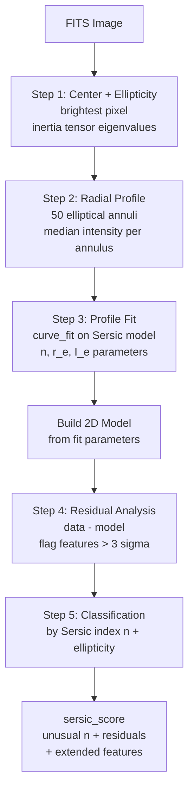
```mermaid
flowchart TD
    IMG[FITS Image] --> CENTER[Step 1: Center + Ellipticity\nbrightest pixel\ninertia tensor eigenvalues]
    CENTER --> PROFILE[Step 2: Radial Profile\n50 elliptical annuli\nmedian intensity per annulus]
    PROFILE --> FIT[Step 3: Profile Fit\ncurve_fit on Sersic model\nn, r_e, I_e parameters]
    FIT --> MODEL[Build 2D Model\nfrom fit parameters]
    MODEL --> RESID[Step 4: Residual Analysis\ndata - model\nflag features > 3 sigma]
    RESID --> CLASS[Step 5: Classification\nby Sersic index n + ellipticity]
    CLASS --> SCORE[sersic_score\nunusual n + residuals\n+ extended features]
```

The Sersic profile is the standard parametric model for galaxy surface brightness:

$$I(r) = I_e \cdot \exp\!\left(-b_n \left[\left(\frac{r}{r_e}\right)^{1/n} - 1\right]\right)$$

Where:
- `I_e`: intensity at the effective (half-light) radius
- `r_e`: effective radius (contains half the total flux)
- `n`: Sersic index (shape parameter)
- $b_n \approx 1.9992n - 0.3271$ (Ciotti & Bertin 1999)

### Step 1: Center and Ellipticity

- Find brightest pixel (smoothed) as galaxy center
- Compute intensity-weighted second moments to get ellipticity and position angle
- Ellipticity: $e = 1 - \sqrt{\lambda_2 / \lambda_1}$ from inertia tensor eigenvalues

### Step 2: Radial Profile Extraction

- 50 elliptical annuli from center to `max_radius_frac * image_size / 2`
- Median intensity in each annulus (robust to cosmic rays/stars)
- Error estimate: $\sigma / \sqrt{N}$ per annulus

### Step 3: Profile Fitting

- Non-linear least squares (scipy.optimize.curve_fit)
- Parameter bounds: I_e > 0, r_e in [0.1, 2*r_max], n in [0.1, 10]
- Reports fit quality as reduced chi-squared

### Step 4: Residual Analysis

- Build full 2D Sersic model from fit parameters
- Residual = data - model
- Flag features with |residual| > 3 sigma (configurable)
- Categorize as "excess" (above model) or "deficit" (below model)

### Step 5: Morphology Classification

| Sersic Index | Classification | Typical Objects |
|---|---|---|
| n < 0.5 | irregular | Magellanic irregulars, peculiar |
| 0.5 < n < 1.5, low e | disk/spiral | Spiral galaxies (exponential disk) |
| 0.5 < n < 1.5, high e | edge-on disk | Edge-on spirals |
| 1.5 < n < 2.5 | lenticular | S0 galaxies |
| 2.5 < n < 5 | elliptical | Normal elliptical galaxies |
| n > 5 | compact/cD | cD galaxies, compact ellipticals |

### Sersic Score

Rewards unusual profiles and residual substructure:
- Low chi-squared (good fit with unusual n) contributes 0.1-0.2
- Extreme Sersic index (n < 0.5 or n > 6) adds 0.2
- High ellipticity (e > 0.6) adds 0.1
- Residual features add up to 0.3 (based on count)
- Extended residual features (>2 r_e from center) at high SNR add 0.1

### Example: What This Finds

- **Tidally disrupted galaxy (score > 0.5):** Good Sersic fit (n ~ 2) but with significant extended residual features from tidal tails
- **cD galaxy (score ~ 0.3):** Very high n (>5) with extended halo
- **Normal elliptical (score ~ 0.1):** Clean n ~ 4 de Vaucouleurs profile with few residuals

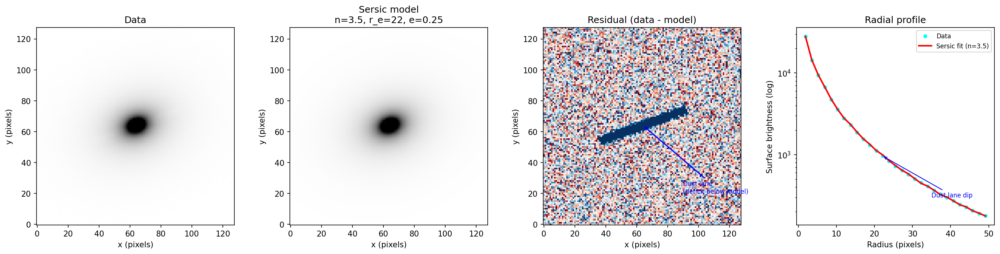

*Sersic profile analysis of a synthetic elliptical galaxy with a dust lane. From left: (1) Data image showing the galaxy. (2) Best-fit Sersic model with n=3.5, r_e=22 px, e=0.25. (3) Residual map (data minus model) in red-blue diverging colormap, revealing the dust lane as a blue stripe (deficit below the smooth model). (4) Radial profile with data points (cyan) and Sersic fit curve (red), showing the dust lane dip at ~22 px radius.*

---

## 12. Wavelet Multi-Scale Analysis

**File:** `detection/wavelet.py`
**Class:** `WaveletAnalyzer`
**Detects:** Features at multiple spatial scales via the a-trous (stationary) wavelet transform.

The a-trous wavelet is the standard multi-scale analysis tool in astronomical image processing (Starck & Murtagh 2002, used in SExtractor). Unlike the standard DWT, it is shift-invariant and preserves image resolution at all scales.

### Algorithm Flow

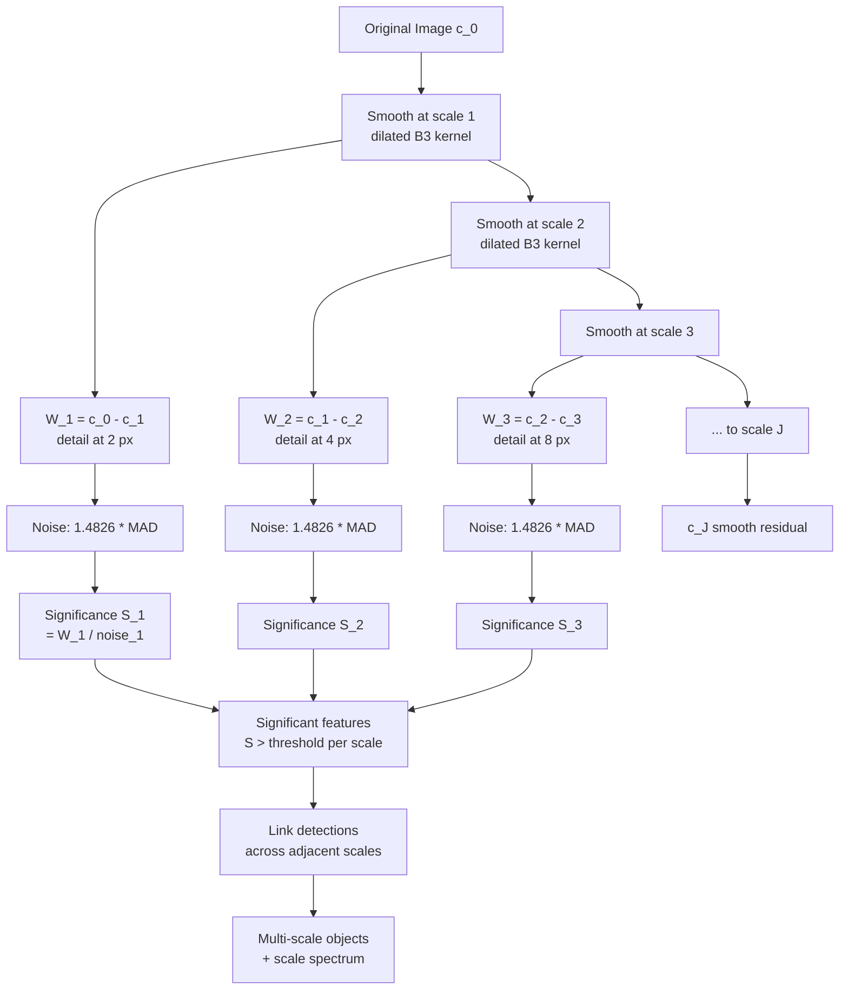
```mermaid
flowchart TD
    IMG[Original Image c_0] --> S1[Smooth at scale 1\ndilated B3 kernel]
    S1 --> W1[W_1 = c_0 - c_1\ndetail at 2 px]
    S1 --> S2[Smooth at scale 2\ndilated B3 kernel]
    S2 --> W2[W_2 = c_1 - c_2\ndetail at 4 px]
    S2 --> S3[Smooth at scale 3]
    S3 --> W3[W_3 = c_2 - c_3\ndetail at 8 px]
    S3 --> SN[... to scale J]
    SN --> CJ[c_J smooth residual]

    W1 --> NOISE1[Noise: 1.4826 * MAD]
    W2 --> NOISE2[Noise: 1.4826 * MAD]
    W3 --> NOISE3[Noise: 1.4826 * MAD]

    NOISE1 --> SIG1[Significance S_1\n= W_1 / noise_1]
    NOISE2 --> SIG2[Significance S_2]
    NOISE3 --> SIG3[Significance S_3]

    SIG1 --> DET[Significant features\nS > threshold per scale]
    SIG2 --> DET
    SIG3 --> DET
    DET --> LINK[Link detections\nacross adjacent scales]
    LINK --> MSO[Multi-scale objects\n+ scale spectrum]
```

### A-Trous Decomposition

Uses the B3 spline scaling function: kernel = [1, 4, 6, 4, 1] / 16.

At each scale j, the kernel is dilated by inserting 2^j - 1 zeros between elements. This makes the effective kernel size grow as 4*2^j + 1 pixels without changing the number of operations.

**Decomposition:**
```
c_0 = original image
For j = 1 to J:
    c_j = convolve(c_{j-1}, dilated_kernel_j)   # smoothed at scale j
    W_j = c_{j-1} - c_j                          # detail (wavelet) coefficients at scale j
```

**Perfect reconstruction:** $\text{original} = W_1 + W_2 + \cdots + W_J + c_J$

Scale j is sensitive to features of size approximately 2^j pixels.

### Noise Estimation and Significance

Per-scale noise estimated via the Median Absolute Deviation:

$\sigma_j = 1.4826 \cdot \text{median}(|W_j|)$

MAD is robust to source contamination (unlike standard deviation, which is biased by the features being detected).

Significance map: $S_j = |W_j| / \sigma_j$

Features with S_j > 3.0 (configurable) are statistically significant at that scale.

### Multi-Scale Objects

Detections at adjacent scales near the same position are linked into multi-scale objects. An object detected at scales 2, 3, and 4 spans a range of sizes, indicating a resolved extended source.

Match radius between scales: $\max(2^j \cdot 2,\; 5)$ pixels.

Objects spanning >= 2 scales are "multi-scale objects." Those detected at scale >= 3 are "extended."

### Scale Spectrum

The energy at each scale, normalized to sum to 1:

$$E_j = \frac{\sum W_j^2}{\sum_k W_k^2}$$

- Point sources: energy concentrated at small scales (j=1,2)
- Extended emission: energy at large scales (j=3,4,5)
- Multi-scale structure: broad energy distribution

### Wavelet Score

$$\begin{aligned}
\text{score} &= \min(n_\text{multiscale} / 10,\; 0.3) \\
&+ \min(n_\text{extended} / 5,\; 0.2) \\
&+ \min(E_\text{coarse} / E_\text{fine},\; 0.2) \\
&+ \min(n_\text{features} / 30,\; 0.15) \\
&+ 0.15 \text{ if } S_\max > 10
\end{aligned}$$

### Example: What This Finds

- **Galaxy with embedded structure:** Energy distributed across scales 1-4, multiple multi-scale objects from star-forming knots
- **Faint extended emission:** Most energy at scales 4-5, few point sources
- **Crowded star field:** Energy concentrated at scales 1-2, many point-like detections
- **Nebular filaments:** Elongated features detected at scales 2-3 with high significance

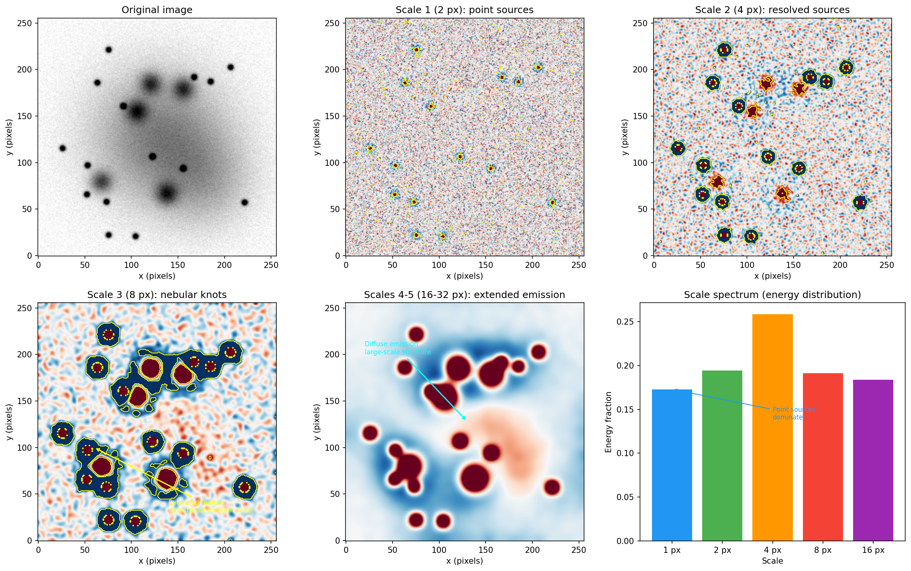

*A-trous wavelet decomposition of a synthetic image containing point sources, nebular knots, and diffuse emission. Top left: Original image. Top center: Scale 1 (2 px) detail -- point sources dominate (yellow contours mark 3-sigma significant features). Top right: Scale 2 (4 px) detail -- resolved sources. Bottom left: Scale 3 (8 px) detail -- extended nebular knots annotated. Bottom center: Scales 4-5 combined -- large-scale diffuse emission. Bottom right: Scale spectrum (energy distribution) showing that point sources at small scales contain the most energy in this field.*

---

## 13. Stellar Population Analysis

**File:** `detection/stellar_population.py`
**Class:** `StellarPopulationAnalyzer`
**Detects:** Stellar population features via color-magnitude diagram (CMD) analysis: main sequence turnoff, red giant branch, blue stragglers, multiple populations.

Requires catalog entries with color (BP-RP from Gaia or g-r from SDSS) and magnitude. Needs at least 20 photometric sources.

### Algorithm Flow

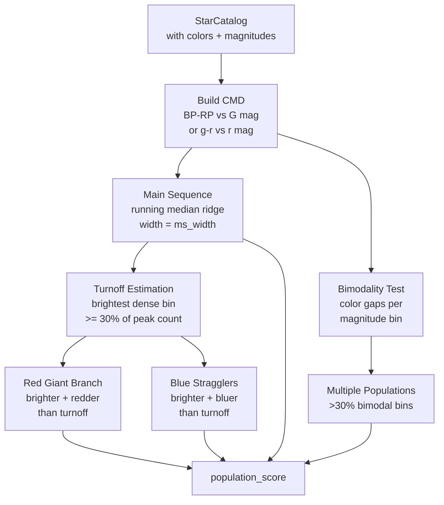
```mermaid
flowchart TD
    CAT[StarCatalog\nwith colors + magnitudes] --> CMD[Build CMD\nBP-RP vs G mag\nor g-r vs r mag]
    CMD --> MS[Main Sequence\nrunning median ridge\nwidth = ms_width]
    MS --> TURNOFF[Turnoff Estimation\nbrightest dense bin\n>= 30% of peak count]
    TURNOFF --> RGB[Red Giant Branch\nbrighter + redder\nthan turnoff]
    TURNOFF --> BS[Blue Stragglers\nbrighter + bluer\nthan turnoff]
    CMD --> BIMOD[Bimodality Test\ncolor gaps per\nmagnitude bin]
    BIMOD --> MULTIPOP[Multiple Populations\n>30% bimodal bins]

    RGB --> PS[population_score]
    BS --> PS
    MULTIPOP --> PS
    MS --> PS
```

### Color-Magnitude Diagram Construction

Uses Gaia photometry by default:
- Color axis: BP-RP (blue-red color index)
- Magnitude axis: G-band apparent magnitude

Falls back to SDSS g-r color and r-band magnitude if Gaia data is unavailable.

### Main Sequence Identification

The main sequence is the locus of hydrogen-burning stars in the CMD.

**Algorithm:**
1. Sort by magnitude, divide into bins (n = max(5, N/20))
2. Running median color per bin defines the main sequence ridge
3. Sources within `ms_width` (default 0.3 mag) of the ridge are MS members
4. **Turnoff estimation:** The brightest magnitude bin with >= 30% of the peak bin count. This density-based method prevents sparse blue stragglers from biasing the turnoff.

### Red Giant Branch Detection

Red giants are evolved stars that have left the main sequence and expanded to become luminous and red.

**Criteria:**
- Brighter than turnoff + 0.5 magnitudes
- Redder than turnoff color + 0.3 magnitudes
- RGB tip: the brightest red giant (important distance indicator)

### Blue Straggler Detection

Blue stragglers are stars that appear younger (bluer, brighter) than the main sequence turnoff. They result from binary star mergers or mass transfer.

**Criteria:**
- Brighter than the turnoff magnitude
- Bluer than turnoff color - `blue_straggler_offset` (default 0.3)

Blue stragglers are scientifically interesting because they indicate binary interactions and stellar collisions.

### Multiple Population Detection

Some globular clusters and open clusters contain multiple stellar populations with different ages or metallicities, visible as parallel sequences in the CMD.

**Algorithm:** Test for bimodality in color at fixed magnitude:
1. In each magnitude bin, sort colors
2. Compute gaps between consecutive colors
3. If the largest gap > 3x the median gap, the bin is bimodal
4. If > 30% of bins are bimodal, flag as multiple populations

### Population Score

$$\begin{aligned}
\text{score} &= \min(n_\text{BS} / 5,\; 0.25) \\
&+ 0.2 \text{ if multiple populations} \\
&+ 0.15 \text{ if } f_\text{RGB} > 0.1 \\
&+ 0.15 \text{ if MS width} < 0.15 \text{ mag} \\
&+ 0.1 \text{ if color spread} > 1.0 \text{ mag} \\
&+ \min(n_\text{color\_outliers} / 10,\; 0.15)
\end{aligned}$$

### Example: What This Finds

- **Globular cluster (score > 0.5):** Tight main sequence (width < 0.15 mag), clear red giant branch, blue stragglers, possibly multiple populations
- **Old open cluster (score ~ 0.3):** Defined turnoff, some RGB stars, 1-2 blue stragglers
- **Field population (score ~ 0.1):** Broad main sequence, no clear features, few outliers

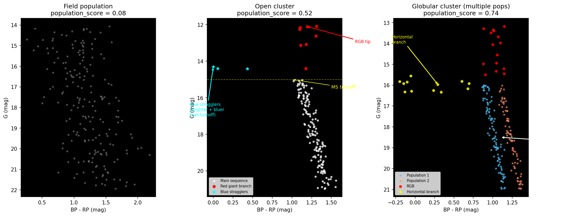

*Three CMD examples showing increasing population complexity. Left: Field population with broad, featureless main sequence (score=0.08). Center: Open cluster with a tight main sequence, defined turnoff (yellow dashed line), red giant branch (red points with RGB tip annotated), and 3 blue stragglers (cyan stars, brighter and bluer than the turnoff -- score=0.52). Right: Globular cluster with two parallel main sequences (blue and orange populations), horizontal branch (yellow), and RGB (red) -- the multiple populations are detected via color bimodality testing (score=0.74).*

---

## 14. Time-Domain Variability Analysis

**File:** `detection/variability.py`
**Class:** `VariabilityAnalyzer`
**Detects:** Photometric variability, periodic signals, and transient outbursts from multi-epoch light curves.

This is the only detector that operates on time-domain data. It requires light curves stored in `CatalogEntry.properties["ztf_lightcurve"]`, typically from the ZTF data source.

**Data source:** ZTF (Zwicky Transient Facility) provides light curves in g, r, and i bands from the Palomar 48-inch telescope. Light curves are fetched via IRSA TAP and stored as `{band: [(mjd, mag, magerr), ...]}`.

### Algorithm Flow

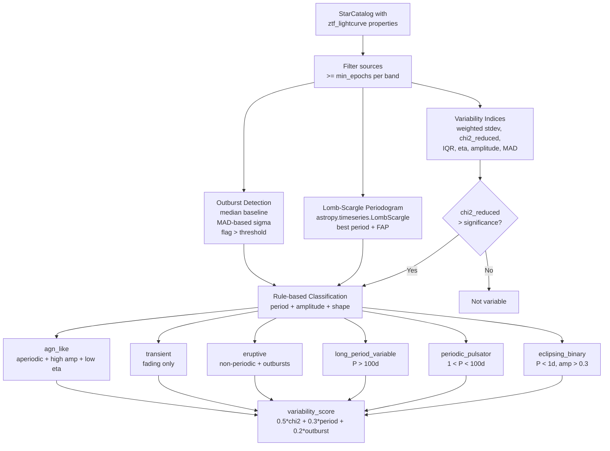
```mermaid
flowchart TD
    CAT[StarCatalog with\nztf_lightcurve properties] --> FILTER[Filter sources\n>= min_epochs per band]
    FILTER --> VAR[Variability Indices\nweighted stdev, chi2_reduced,\nIQR, eta, amplitude, MAD]
    FILTER --> LS[Lomb-Scargle Periodogram\nastropy.timeseries.LombScargle\nbest period + FAP]
    FILTER --> OB[Outburst Detection\nmedian baseline\nMAD-based sigma\nflag > threshold]

    VAR --> ISVAR{chi2_reduced\n> significance?}
    ISVAR -- Yes --> CLASSIFY[Rule-based Classification\nperiod + amplitude + shape]
    ISVAR -- No --> SKIP[Not variable]

    LS --> CLASSIFY
    OB --> CLASSIFY

    CLASSIFY --> EB[eclipsing_binary\nP < 1d, amp > 0.3]
    CLASSIFY --> PP[periodic_pulsator\n1 < P < 100d]
    CLASSIFY --> LPV[long_period_variable\nP > 100d]
    CLASSIFY --> ERUPT[eruptive\nnon-periodic + outbursts]
    CLASSIFY --> TRANS[transient\nfading only]
    CLASSIFY --> AGN[agn_like\naperiodic + high amp + low eta]

    EB --> SCORE[variability_score\n0.5*chi2 + 0.3*period + 0.2*outburst]
    PP --> SCORE
    LPV --> SCORE
    ERUPT --> SCORE
    TRANS --> SCORE
    AGN --> SCORE
```

### Variability Index Computation

For each source with sufficient epochs (>= min_epochs, default 10), six variability indices are computed:

**Weighted Standard Deviation:**

$$w_i = 1 / \sigma_i^2, \quad \bar{m}_w = \frac{\sum m_i w_i}{\sum w_i}, \quad \text{wsd} = \sqrt{\frac{\sum (m_i - \bar{m}_w)^2 w_i}{\sum w_i}}$$
Measures the intrinsic scatter after accounting for measurement errors.

**Reduced Chi-Squared:**

$$\chi^2_\text{red} = \frac{1}{N-1} \sum \left(\frac{m_i - \bar{m}_w}{\sigma_i}\right)^2$$
The key variability metric. For a truly constant source with correctly estimated errors, chi2_reduced ~ 1.0. Values >> 1 indicate real variability above the noise.

- chi2_reduced < 3: consistent with constant (not variable)
- chi2_reduced > 3: likely variable (default threshold, genome-tunable)
- chi2_reduced > 100: strongly variable

**Interquartile Range (IQR):**

$\text{IQR} = Q_{75} - Q_{25}$
Robust amplitude measure, less sensitive to outliers than max-min.

**Von Neumann Ratio (eta):**

$$\eta = \frac{1}{N-1} \cdot \frac{\sum (m_{i+1} - m_i)^2}{\text{Var}(m)}$$
Where magnitudes are sorted by time. Measures whether the variability is time-correlated:
- eta ~ 2: uncorrelated (pure noise)
- eta < 2: time-correlated (smooth variability, pulsations, eclipses)
- eta > 2: anti-correlated (very rare)

Low eta + high chi2 = real astrophysical variability. High eta + high chi2 = uncorrelated scatter (possibly bad photometry).

**Amplitude:**

$\text{amplitude} = \max(m) - \min(m)$

**Median Absolute Deviation (MAD):**

$\text{MAD} = \text{median}(|m - \text{median}(m)|)$

### Lomb-Scargle Periodogram

The Lomb-Scargle periodogram is the standard tool for finding periodic signals in unevenly sampled time series (astronomical observations are never evenly spaced).

**Implementation:** `astropy.timeseries.LombScargle`

**Frequency grid:**
- Minimum frequency: 1 / min(period_max, baseline/2)
- Maximum frequency: 1 / period_min
- Up to 10,000 frequency points (capped for performance)

**Output:**
- Best period (days) and its power (0-1 scale)
- False alarm probability (FAP): the probability that noise alone could produce the observed peak power
- `is_periodic = FAP < 0.01` (1% significance level)

**Period recovery accuracy:** In tests with injected sinusoids, period recovery is within 10% for well-sampled light curves (200+ epochs, SNR > 10).

### Outburst Detection

Identifies sudden brightening or fading events relative to a baseline.

**Algorithm:**
1. Baseline: median magnitude of the full light curve
2. Scatter: $\sigma = 1.4826 \cdot \text{MAD}$ (robust estimator)
3. Deviation: $(\text{median} - m) / \sigma$ (positive = brighter)
4. Flag points with |deviation| > significance_threshold (default 3.0)
5. Classify as "brightening" (deviation > 0) or "fading" (deviation < 0)

### Variable Star Classification

A deterministic, rule-based classifier that categorizes variable sources:

| Classification | Criteria | Astrophysical Examples |
|---|---|---|
| `eclipsing_binary` | Periodic, period < 1 day, amplitude > 0.3 mag | Algol, W UMa systems |
| `periodic_pulsator` | Periodic, 1 < period < 100 days | Cepheids, RR Lyrae, Delta Scuti |
| `long_period_variable` | Periodic, period > 100 days | Mira variables, semiregulars |
| `eruptive` | Non-periodic, has outbursts (1-3 brightenings) | Young stellar objects, novae |
| `transient` | Fading only (no brightenings) | Supernovae, tidal disruption events |
| `agn_like` | Non-periodic, amplitude > 0.5, low eta (< 1.5) | Active galactic nuclei, quasars |
| `unclassified_variable` | Variable but doesn't match above | Other types |

### Variability Score

**Per-source score:**

$$\begin{aligned}
s_{\chi^2} &= \text{clip}(\log_{10}(\max(\chi^2_\text{red},\; 1)) / 2,\; 0,\; 1) \\
s_\text{period} &= \text{clip}(\text{power},\; 0,\; 1) \cdot (1.0 \text{ if FAP} < 0.01 \text{ else } 0.3) \\
s_\text{outburst} &= \text{clip}(n_\text{outbursts} / 5,\; 0,\; 1) \\
s_\text{source} &= 0.5 \cdot s_{\chi^2} + 0.3 \cdot s_\text{period} + 0.2 \cdot s_\text{outburst}
\end{aligned}$$

**Overall variability_score:**

$$\text{variability\_score} = 0.4 \cdot \frac{n_\text{variable}}{n_\text{analyzed}} + 0.6 \cdot \text{mean}(\text{top 10 source scores})$$

### Parameters

| Parameter | Default | Range (Genome) | Effect |
|---|---|---|---|
| `variability_min_epochs` | 10 | 5 - 30 | Minimum data points for analysis; too low = noisy results |
| `variability_significance` | 3.0 | 1.5 - 5.0 | Chi-squared threshold for "variable"; lower = more detections |
| `variability_period_min` | 0.1 days | 0.01 - 1.0 | Shortest period searched; < 0.1 = very fast variables |
| `variability_period_max` | 500 days | 100 - 1000 | Longest period searched; limited by baseline |

### Example: What This Finds

- **Eclipsing binary (score > 0.7):** Period = 0.37 days, amplitude = 0.8 mag, clean periodic signal with FAP < 0.001. The light curve shows symmetric dips repeating like clockwork.
- **RR Lyrae pulsator (score ~ 0.5):** Period = 0.55 days, amplitude = 0.5 mag, periodic with asymmetric light curve (fast rise, slow decline).
- **AGN variability (score ~ 0.4):** No period detected (FAP > 0.5), but amplitude > 1 mag over 3 years with correlated wandering (low eta). Consistent with stochastic AGN variability.
- **Supernova candidate (score ~ 0.6):** Sudden 4-mag brightening followed by fading over weeks. Classified as "transient."
- **Quiet field (score ~ 0.05):** All sources have chi2_reduced < 2. No variable candidates detected.

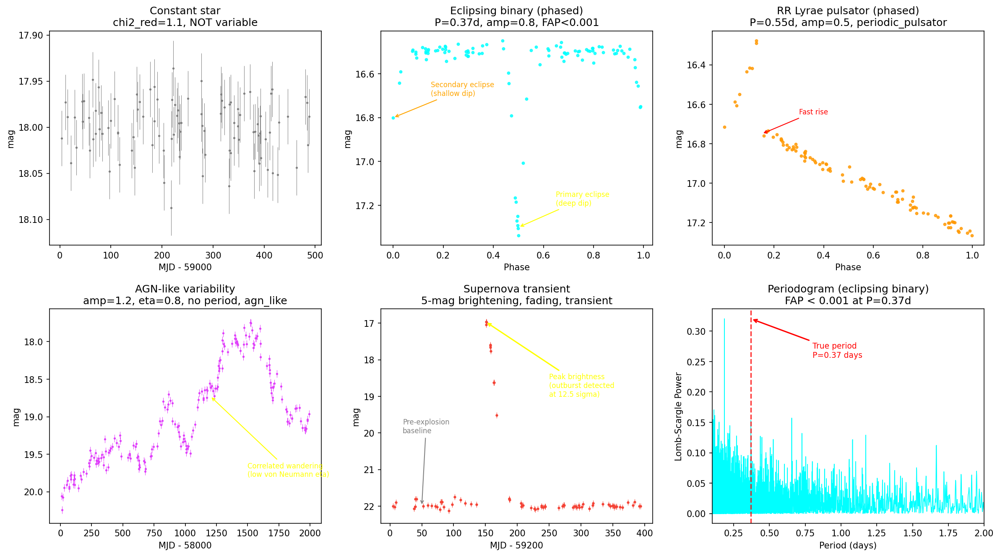

*Six variability scenarios. Top left: Constant star with chi2_red=1.1 (not variable). Top center: Eclipsing binary phased at P=0.37d showing primary and secondary eclipses (amp=0.8, FAP<0.001). Top right: RR Lyrae pulsator phased at P=0.55d with characteristic fast-rise, slow-decline shape. Bottom left: AGN-like stochastic variability with correlated wandering (low von Neumann eta=0.8, no period). Bottom center: Supernova transient showing dramatic 5-mag brightening (outburst detected at 12.5 sigma) followed by fading. Bottom right: Lomb-Scargle periodogram for the eclipsing binary showing the power peak at the true period (red dashed line).*

---

## 15. Temporal Image Differencing

**File:** `detection/temporal.py`
**Class:** `TemporalDetector`
**Detects:** Changes across multiple epochs of imaging: new sources, disappeared sources, brightenings, fadings, and moving objects via image differencing.

This detector operates on multi-epoch images (`EpochImage` objects) rather than single-epoch FITS images or catalogs. It requires at least 2 epochs in any band to construct a reference and compute differences. Epoch images can come from ZTF (IRSA IBE cutouts), MAST (HST/JWST), or SDSS Stripe 82 -- the `DataPipeline` merges them all by band before passing to the detector.

### Algorithm Flow

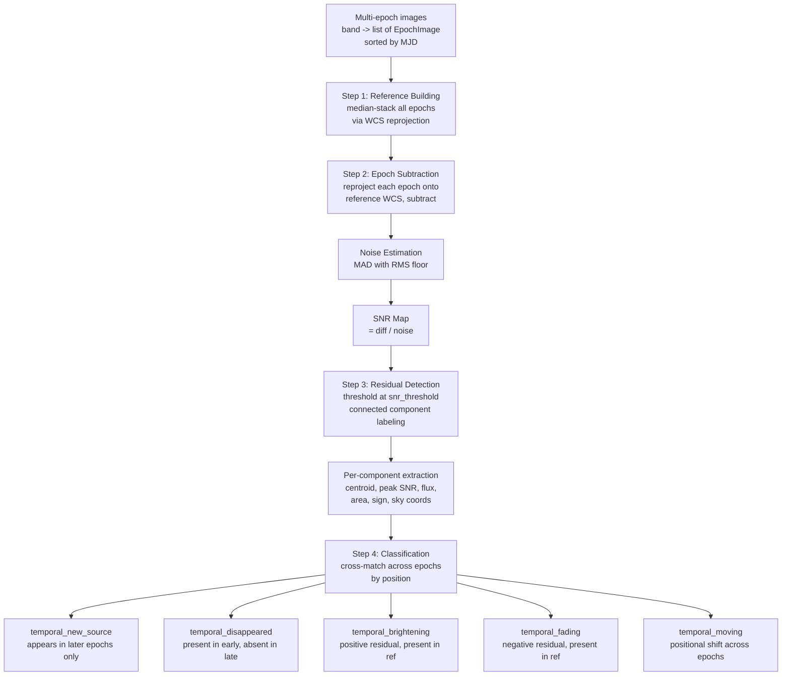
```mermaid
flowchart TD
    EPOCHS[Multi-epoch images\nband -> list of EpochImage\nsorted by MJD] --> REF[Step 1: Reference Building\nmedian-stack all epochs\nvia WCS reprojection]
    REF --> DIFF[Step 2: Epoch Subtraction\nreproject each epoch onto\nreference WCS, subtract]
    DIFF --> NOISE[Noise Estimation\nMAD with RMS floor]
    NOISE --> SNR[SNR Map\n= diff / noise]
    SNR --> THRESH[Step 3: Residual Detection\nthreshold at snr_threshold\nconnected component labeling]
    THRESH --> COMP[Per-component extraction\ncentroid, peak SNR, flux,\narea, sign, sky coords]
    COMP --> CLASS[Step 4: Classification\ncross-match across epochs\nby position]
    CLASS --> NEW[temporal_new_source\nappears in later epochs only]
    CLASS --> DIS[temporal_disappeared\npresent in early, absent in late]
    CLASS --> BRI[temporal_brightening\npositive residual, present in ref]
    CLASS --> FAD[temporal_fading\nnegative residual, present in ref]
    CLASS --> MOV[temporal_moving\npositional shift across epochs]
```

### Step 1: Reference Building

The reference image is constructed by median-stacking all epochs after WCS reprojection onto a common grid:

1. Choose the first epoch's WCS as the reference frame
2. Reproject each epoch onto the reference WCS using `reproject_interp`
3. Compute the pixel-wise median across all reprojected epochs

The median naturally rejects transient events: a source that appears in only 1-2 of 10 epochs will not contaminate the reference. This is key for detecting new sources and transients without a separate "template" image.

### Step 2: Epoch Subtraction

For each epoch:
1. Reproject onto the reference WCS (if not already aligned)
2. Compute the difference image: `diff = epoch - reference`
3. Estimate noise via the Median Absolute Deviation: `noise = 1.4826 * median(|diff|)`
4. Apply a noise floor: `noise = max(MAD, RMS_of_quietest_80% * 0.01)` to prevent near-zero noise when epochs share identical WCS (floating-point-only differences)
5. Compute SNR map: `SNR = diff / noise`

The noise floor is critical: without it, perfectly aligned epochs produce astronomically high SNR values for any real change because the MAD of their difference is near-zero.

### Step 3: Residual Detection

Significant residuals are extracted via connected-component labeling:

1. Threshold the SNR map at `snr_threshold` (default 5.0, genome-tunable)
2. Apply `scipy.ndimage.label` to find connected components
3. For each component, extract:
   - Centroid position (pixel and sky via WCS)
   - Peak SNR value
   - Integrated flux (sum of difference pixels)
   - Area in pixels
   - Sign (positive = brighter than reference, negative = fainter)

### Step 4: Classification

Residuals are cross-matched across epochs by position to classify the type of change:

| Classification | Criteria | Astrophysical Examples |
|---|---|---|
| `temporal_new_source` | Positive residual in late epochs, absent in early epochs | Supernovae, novae, flare stars |
| `temporal_disappeared` | Negative residual in late epochs, present in early epochs | Fading transients, eclipses, catalog artifacts |
| `temporal_brightening` | Positive residual, source present in reference at same position | AGN flares, variable star maxima, microlensing |
| `temporal_fading` | Negative residual, source present in reference | Variable star minima, dust obscuration |
| `temporal_moving` | Positional shift of a residual across epochs | Asteroids, high-proper-motion stars, satellite trails |

### Multi-Source Epoch Images

The `DataPipeline` collects epoch images from all available sources via the `DataSource.fetch_epoch_images()` interface:

| Source | Coverage | Epoch Key | MJD Source | Typical Baseline |
|---|---|---|---|---|
| ZTF | Northern sky (Dec > -30), g/r/i | filefracday | JD - 2400000.5 | Days to years |
| MAST (HST/JWST) | Pointed observations, any filter | obs_id | t_min (already MJD) | Months to decades |
| SDSS Stripe 82 | Dec [-1.5, +1.5], RA [310, 60], ugriz | run number | TAI / 86400 from FITS header | Months to years |

Sources without epoch support (e.g., Gaia) return `{}` from the base class default. Epochs from multiple sources in the same band are merged into a single MJD-sorted list. The TemporalDetector handles heterogeneous pixel scales and projections via WCS reprojection, so mixing ZTF (1"/px) with HST (0.05"/px) works correctly.

**SDSS Stripe 82 gate:** A fast `_in_stripe82(ra, dec)` check (Dec in [-1.5, +1.5] AND (RA >= 310 OR RA <= 60)) prevents wasted queries for the ~65% of sky with single-epoch SDSS coverage.

### Temporal Score

$$\begin{aligned}
\text{score} &= 0.3 \cdot \min(n_\text{findings} / 5,\; 1) \\
&+ 0.3 \cdot \min(\text{peak\_snr} / 20,\; 1) \\
&+ 0.2 \cdot \sum_t w_t \cdot \mathbb{1}[\text{type } t \text{ found}] \\
&+ 0.2 \cdot \min(n_\text{types} / 3,\; 1)
\end{aligned}$$

Where the type importance weights $w_t$ prioritize new sources and moving objects over simple brightenings/fadings.

### Parameters

| Parameter | Default | Range (Genome) | Effect |
|---|---|---|---|
| `temporal_snr_threshold` | 5.0 | 3.0 - 10.0 | Minimum SNR for residual detection; lower = more detections |
| `temporal_min_epochs` | 3 | 2 - 10 | Minimum epochs required per band |
| `temporal_weight` | 0.0 | 0.0 - 1.0 | Ensemble weight (activated when epochs available) |

The `fetch_interval` config (default 5 cycles) controls how often epoch images are fetched during autonomous discovery to limit network usage.

### Example: What This Finds

- **Supernova (score > 0.7):** New source appearing at 15-sigma in late-epoch ZTF images at a position with no reference source. Cross-match with TNS may confirm.
- **AGN flare (score ~ 0.5):** Brightening at 8-sigma over 200 days in r-band, source present in reference. Multi-year MAST baseline shows prior quiescent state.
- **Asteroid (score ~ 0.4):** Moving source detected at 3 positions across 3 nights, classified as `temporal_moving`.
- **Fading variable (score ~ 0.3):** 5-sigma fading in 2 of 10 epochs, classified as `temporal_fading`.
- **No temporal data (score = 0):** Region has no multi-epoch coverage, or all epochs are too similar. Detector returns gracefully with zero score.

---

## 16. Ensemble Scoring

**File:** `detection/ensemble.py`
**Class:** `EnsembleDetector`

The ensemble combines all 14 detector scores into a single anomaly_score:

$$\begin{aligned}
\text{anomaly\_score} &= w_\text{classical} \cdot s_\text{classical} \\
&+ w_\text{morphology} \cdot s_\text{morphology} \\
&+ w_\text{anomaly} \cdot s_\text{anomaly} \\
&+ w_\text{lens} \cdot s_\text{lens} \\
&+ w_\text{distribution} \cdot s_\text{distribution} \\
&+ w_\text{galaxy} \cdot s_\text{galaxy} \\
&+ w_\text{kinematic} \cdot s_\text{kinematic} \\
&+ w_\text{transient} \cdot s_\text{transient} \\
&+ w_\text{sersic} \cdot s_\text{sersic} \\
&+ w_\text{wavelet} \cdot s_\text{wavelet} \\
&+ w_\text{population} \cdot s_\text{population} \\
&+ w_\text{variability} \cdot s_\text{variability} \\
&+ w_\text{temporal} \cdot s_\text{temporal}
\end{aligned}$$

### Default Weights

| Detector | Weight | Rationale |
|---|---|---|
| classical | 0.09 | Background texture detection |
| morphology | 0.09 | Galaxy shape anomalies |
| anomaly | 0.09 | Statistical outlier in feature space |
| lens | 0.09 | Gravitational lensing (rare, high-value) |
| distribution | 0.11 | Spatial clustering (common, reliable) |
| galaxy | 0.09 | Merger/interaction signatures |
| kinematic | 0.09 | Moving group detection |
| transient | 0.04 | Catalog-level variability indicators (limited) |
| sersic | 0.07 | Galaxy structure |
| wavelet | 0.09 | Multi-scale features |
| population | 0.06 | CMD anomalies |
| variability | 0.09 | Time-domain light curve analysis |
| temporal | 0.0 | Image differencing (activated when epoch images available) |

All weights are genome-tunable and normalized to sum to 1 during evolution.

### How Evolution Tunes Weights

The genetic algorithm includes 11 weight genes (one per scoring detector) that evolve over generations. Weights are normalized to sum to 1 in `DetectionGenome.to_detection_config()`. This means the pipeline automatically learns which detectors are most informative for finding interesting patterns in the specific sky regions being surveyed.

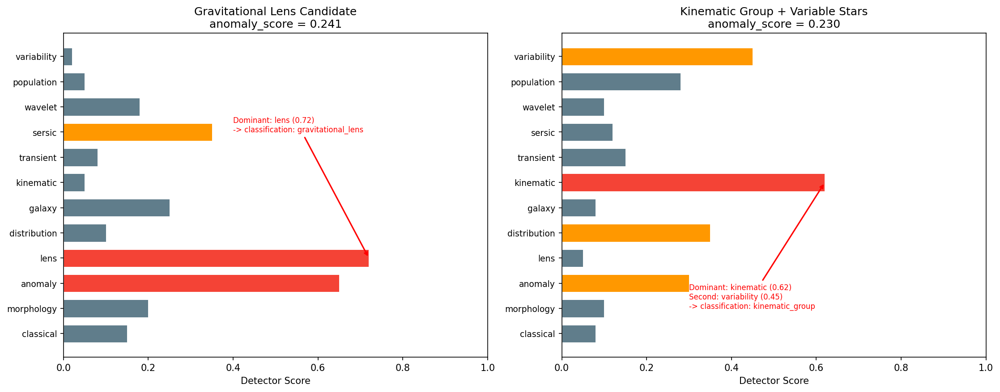

*Two ensemble scoring examples showing how detector scores combine. Left: Gravitational lens candidate -- the lens detector dominates at 0.72, with anomaly at 0.65 and sersic at 0.35 as supporting signals. The weighted ensemble score is 0.250 and the classification is "gravitational_lens." Right: Kinematic group with variable stars -- the kinematic detector leads at 0.62, with variability at 0.45 and distribution at 0.35, producing a weighted score of 0.252 classified as "kinematic_group." Gray bars indicate low scores (< 0.3), orange indicates moderate (0.3-0.5), and red indicates high (> 0.5).*

---

## 17. Cross-Detector Feature Fusion

**File:** `detection/feature_fusion.py`
**Class:** `FeatureFusionExtractor`
**Purpose:** Extract a rich ~60-dimensional feature vector from the full detection results, preserving cross-detector information lost by scalar scoring.

### Why Feature Fusion?

The weighted ensemble reduces 13 detector outputs to a single scalar (anomaly_score), discarding rich intermediate data. For example, both "high wavelet + low morphology" and "moderate wavelet + moderate morphology" can produce the same ensemble score, but they represent very different patterns. Feature fusion preserves this distinction.

### Feature Groups

| Group | Dims | Features |
|---|---|---|
| Sources | 5 | n_sources, mean_flux, flux_std, spatial_concentration, ellipticity_mean |
| Classical | 6 | gabor_score, fft_score, arc_score, n_arcs, dominant_frequency, dominant_orientation |
| Morphology | 6 | concentration, asymmetry, smoothness, gini, m20, morphology_score |
| Lens | 5 | lens_score, n_arcs, n_rings, arc_coverage, is_candidate |
| Distribution | 4 | distribution_score, voronoi_cv, clark_evans_r, n_overdensities |
| Galaxy | 4 | galaxy_score, n_tidal, n_mergers, n_color_outliers |
| Kinematic | 4 | kinematic_score, n_groups, n_streams, n_runaways |
| Transient | 4 | transient_score, n_astrometric, n_photometric, n_parallax |
| Sersic | 5 | sersic_score, sersic_n, r_e, ellipticity, n_residual_features |
| Wavelet | 4 | wavelet_score, n_detections, n_multiscale, mean_scale |
| Population | 4 | population_score, n_blue_stragglers, n_red_giants, multiple_populations |
| Variability | 4 | variability_score, n_variables, n_periodic, n_transients |
| Temporal | 6 | temporal_score, n_new_sources, n_disappeared, n_brightening, n_fading, n_moving |

All missing or errored fields default to 0. The feature vector is stored in `results["rich_features"]` and consumed by the MetaDetector and FitnessEvaluator.

### Usage in the Pipeline

```
EnsembleDetector.detect(image, catalog)
  -> 13 detector scores + spatial data
  -> FeatureFusionExtractor.extract(results) -> ~60-D feature vector
  -> results["rich_features"] = feature_vector
```

---

## 18. Learned Meta-Detector

**File:** `detection/meta_detector.py`
**Class:** `MetaDetector`
**Purpose:** Learn non-linear cross-detector scoring from active learning feedback, replacing the fixed linear ensemble for experienced systems.

### The Problem with Linear Scoring

The weighted ensemble computes $\text{anomaly\_score} = \sum(w_i \cdot s_i)$. This is purely linear -- it cannot learn that "high wavelet + low morphology + moderate distribution" means something qualitatively different from high scores across the board. Non-linear interactions between detectors are invisible.

### Progressive Model Complexity

The MetaDetector automatically upgrades its model as more labeled data accumulates:

| Label Count | Model | Rationale |
|---|---|---|
| 0-49 | Linear baseline | Identical to weighted ensemble; no learning yet |
| 50-199 | Gradient boosting (GBM) | `sklearn.ensemble.GradientBoostingClassifier`; handles non-linear interactions with small data |
| 200+ | Neural network | PyTorch MLP `[n_features, 64, 32, 1]`; full non-linear capacity |

### How It Works

1. **Feature input:** The ~60-D rich feature vector from FeatureFusionExtractor
2. **Scoring:** $\text{meta\_score} = (1 - w_\text{blend}) \cdot s_\text{linear} + w_\text{blend} \cdot s_\text{learned}$
3. **Learning:** Each active learning feedback event calls `add_sample(features, is_interesting)`
4. **Retraining:** Triggered alongside active learning retraining; model complexity upgrades automatically

The `blend_weight` parameter is genome-evolvable (0.0 = pure linear, 1.0 = pure learned), allowing evolution to control trust in the learned model.

### Feature Importance

After training, `get_feature_importance()` returns a dict mapping feature names to importance scores. For GBM, this uses built-in feature importances; for the neural net, gradient-based attribution. This reveals which cross-detector features are most predictive of interesting patterns.

### Genome Parameters

| Gene | Range | Effect |
|---|---|---|
| `meta_blend_weight` | 0.0 - 1.0 | Balance between linear and learned scoring |
| `meta_gbm_depth` | 2 - 6 | GBM tree depth (complexity control) |
| `meta_gbm_estimators` | 50 - 300 | GBM number of trees |

---

## 19. Compositional Detection Pipelines

**File:** `detection/compositional.py`, `discovery/pipeline_genome.py`, `discovery/pipeline_presets.py`
**Classes:** `ComposedPipeline`, `PipelineGenome`, `OperationRegistry`
**Purpose:** Discover detection strategies through evolution rather than hand-coding, by composing sequences of primitive image operations.

### The Problem with Fixed Detectors

The 13 detectors in the ensemble are hand-coded. They can only find patterns they were designed to detect. The compositional system enables the pipeline to discover strategies like "subtract sersic model, then run wavelet on residual, then threshold at 3-sigma" -- a detection pipeline that emerges from evolution rather than being designed.

### Primitive Operations

Each operation takes `(image, context, params)` and returns `(image, context)`:

| Operation | Purpose | Key Parameters |
|---|---|---|
| `mask_sources` | Zero out detected source positions | radius_px (2-20) |
| `subtract_model` | Subtract Sersic/smooth model | smooth_sigma (1-10) |
| `wavelet_residual` | Extract residual at specific scale | scale (1-7) |
| `threshold_image` | Binary threshold at percentile | percentile (50-99) |
| `convolve_kernel` | Convolve with parameterized kernel | kernel_size (3-15), type |
| `cross_correlate` | Correlate with source density map | smooth_sigma (1-10) |
| `combine_masks` | AND/OR/XOR of current + context mask | mode (and/or/xor) |
| `region_statistics` | Stats on masked regions | stat_type (mean/std/count) |
| `edge_detect` | Sobel/Canny edge detection | method, threshold (1-10) |
| `radial_profile_residual` | Subtract radial profile | center_method |

### Pipeline Genome

`PipelineGenome` encodes a variable-length sequence of 2-5 operations, plus a scoring method. It is separate from the `DetectionGenome` (which encodes 54 detector parameters).

**Mutation types:**
- **Structural:** Add, remove, or swap operations in the sequence
- **Parametric:** Modify parameters of individual operations (Gaussian perturbation)

**Crossover:** Align by position, swap a contiguous segment between parents.

**Example pipeline description:** `subtract_model(sigma=3) -> wavelet_residual(scale=3) -> threshold(95) -> score:component_count`

### Scoring Methods

After the pipeline runs, a scoring function converts the final image + context into a scalar:

| Method | What It Measures |
|---|---|
| `component_count` | Number of connected components above threshold |
| `max_residual` | Maximum pixel value in the processed image |
| `area_fraction` | Fraction of image above threshold |

### Preset Pipelines

Eight curated starting pipelines seed the initial population:
1. Sersic residual analysis
2. Source-subtracted wavelet detection
3. Edge detection on smooth residual
4. Multi-scale radial profile residual
5. Cross-correlation of source density map
6. Threshold of combined wavelet scales
7. Source mask -> radial profile -> residual
8. Convolve kernel -> threshold -> count

### Co-Evolution

Pipeline genomes are co-evolved alongside standard detection genomes during `_evolve_parameters()`. The best pipeline's `composed_score` is injected into the detection results and available as a feature for the meta-detector.

### Genome Parameters

| Gene | Range | Effect |
|---|---|---|
| `composed_weight` | 0.0 - 1.0 | How much composed_score contributes to meta-detector |

---

## 20. Classification and Evaluation

### Classification and Evaluation Flow

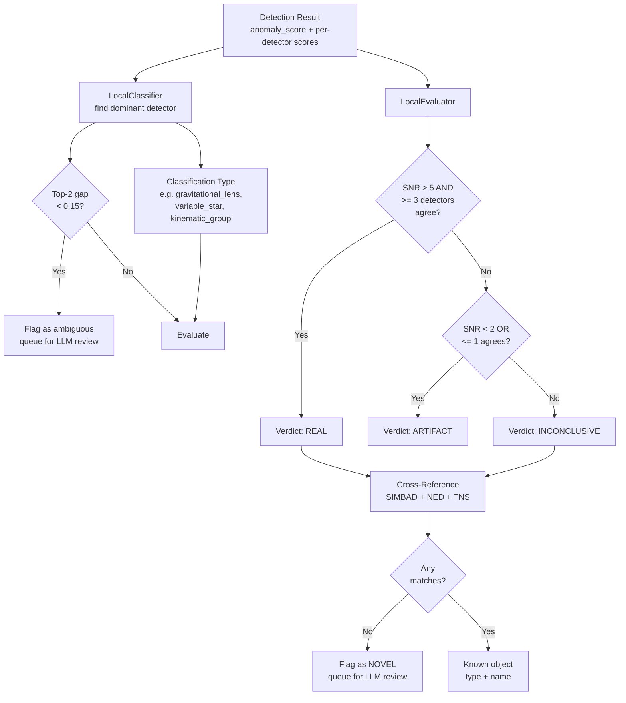
```mermaid
flowchart TD
    DET[Detection Result\nanomaly_score + per-detector scores] --> LC[LocalClassifier\nfind dominant detector]
    LC --> TYPE[Classification Type\ne.g. gravitational_lens,\nvariable_star, kinematic_group]
    LC --> AMB{Top-2 gap\n< 0.15?}
    AMB -- Yes --> FLAG_AMB[Flag as ambiguous\nqueue for LLM review]
    AMB -- No --> EVAL

    DET --> LE[LocalEvaluator]
    LE --> SNR{SNR > 5 AND\n>= 3 detectors\nagree?}
    SNR -- Yes --> REAL[Verdict: REAL]
    SNR -- No --> SNR2{SNR < 2 OR\n<= 1 agrees?}
    SNR2 -- Yes --> ART[Verdict: ARTIFACT]
    SNR2 -- No --> INC[Verdict: INCONCLUSIVE]

    TYPE --> EVAL[Evaluate]
    REAL --> XREF[Cross-Reference\nSIMBAD + NED + TNS]
    INC --> XREF

    XREF --> NOVEL{Any\nmatches?}
    NOVEL -- No --> FLAG_NOV[Flag as NOVEL\nqueue for LLM review]
    NOVEL -- Yes --> KNOWN[Known object\ntype + name]
```

### LocalClassifier

**File:** `detection/local_classifier.py`

After the ensemble produces a detection, the LocalClassifier determines what type of object it is based on which detector scored highest.

**Mapping:**

| Dominant Detector | Classification | Description |
|---|---|---|
| lens | gravitational_lens | Arc/ring features from gravitational lensing |
| morphology | morphological_anomaly | Unusual galaxy shape (CAS/Gini outlier) |
| galaxy | galaxy_interaction | Tidal tails, mergers, color anomalies |
| kinematic | kinematic_group | Co-moving stars, streams, runaways |
| sersic | galaxy_structure | Unusual Sersic profile or residual features |
| wavelet | multiscale_source | Features spanning multiple spatial scales |
| population | stellar_population_anomaly | CMD outliers, blue stragglers, multiple populations |
| distribution | spatial_clustering | Star/galaxy cluster, overdensity, void |
| transient | transient_candidate | Astrometric/photometric variability indicator |
| variability | variable_star | Time-domain light curve variability |
| temporal | temporal_change | Multi-epoch image differencing detection |
| anomaly | statistical_outlier | Unusual detector score combination |
| classical | classical_pattern | Spatial frequency/arc pattern |

**Ambiguity detection:** If the gap between the top-2 detector scores is < 0.15, the detection is flagged as ambiguous and queued for LLM review.

**Novelty detection:** If there are no cross-matches AND confidence > 0.6, the detection is flagged as novel and queued for LLM review.

### LocalEvaluator

**File:** `detection/local_evaluator.py`

Determines whether a detection is real, an artifact, or inconclusive.

**Logic:**
- SNR > 5 AND >= 3 detectors agree (score > 0.3): verdict = "real"
- SNR < 2 OR <= 1 detector agrees: verdict = "artifact"
- Otherwise: verdict = "inconclusive"

**Significance rating (1-10):**
- SNR contribution: 0-4 points
- Detector agreement: 0-3 points
- Statistical significance (Bonferroni-corrected p-value): 0-3 points

---

## 21. Cross-Reference Validation

**File:** `evaluation/cross_reference.py`
**Class:** `CatalogCrossReferencer`

After detection and classification, each finding is cross-referenced against known astronomical catalogs to determine if it is a known or novel object.

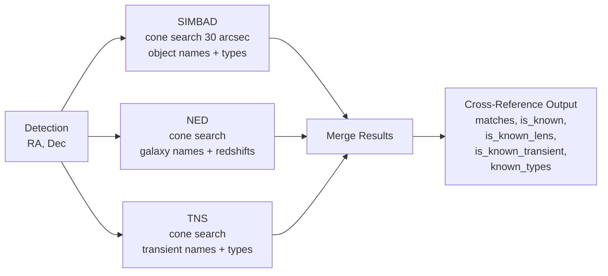
```mermaid
flowchart LR
    DET[Detection\nRA, Dec] --> SIMBAD[SIMBAD\ncone search 30 arcsec\nobject names + types]
    DET --> NED[NED\ncone search\ngalaxy names + redshifts]
    DET --> TNS[TNS\ncone search\ntransient names + types]

    SIMBAD --> MERGE[Merge Results]
    NED --> MERGE
    TNS --> MERGE

    MERGE --> OUT[Cross-Reference Output\nmatches, is_known,\nis_known_lens,\nis_known_transient,\nknown_types]
```

### SIMBAD

The SIMBAD database contains identifications and classifications for millions of astronomical objects. A cone search within the search radius (default 30 arcsec) returns known object names and types.

### NED (NASA/IPAC Extragalactic Database)

Similar to SIMBAD but focused on extragalactic objects. Returns galaxy names, types, and redshifts.

### TNS (Transient Name Server)

The TNS is the official IAU registry for astronomical transients (supernovae, novae, tidal disruption events, etc.). A cone search returns:
- Transient name (e.g., SN 2024abc)
- Type (SN Ia, SN II, nova, TDE, etc.)
- Discovery date
- Redshift

### Cross-Reference Output

```
{
  "matches": [...],           # All matches from all catalogs
  "n_matches": 3,
  "is_known": true,           # Any matches found
  "is_known_lens": false,     # Known gravitational lens
  "is_known_transient": true, # Known TNS transient
  "known_types": ["SN*", "G"] # Unique object types
}
```

A detection with no cross-matches is flagged as potentially novel and prioritized for follow-up and LLM review.